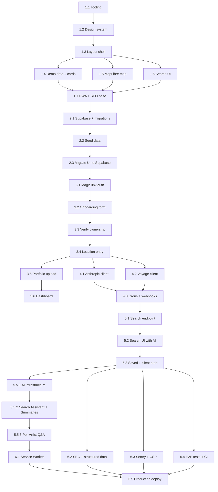

# InkSpot — Detailed Implementation Plan

## Context

InkSpot is a mobile-first tattoo artist directory. Artists sign up with email (magic-link), verify ownership of their Instagram handle via a bio code, upload their portfolio directly, and get a public profile with AI-powered style matching. The technical differentiator is the combined ranking of geolocation + style similarity via Claude Vision + embeddings. This plan covers the 6 phases from the current scaffold to production on Vercel.

**Current base:** Next.js 16.2.4, React 19, Tailwind CSS 4, ESLint 9 flat config. No `src/` — everything from the root. AGENTS.md warns of breaking changes in Next.js 16 vs. 15.

---

## Plan Revisions

| Date | Change | Rationale |
|---|---|---|
| 2026-04-28 | Replaced Phase 5.5 RAG architecture with structured-data + LLM features | Data shape doesn't justify retrieval overhead: top-5 results are already selected by `search_artists()`, a single artist's full portfolio fits in one Haiku context window, and summary generation is a batch job — no query-time vector retrieval needed at this scale |
| 2026-04-28 | Added mobile artist locations model (`artist_locations` table, replaces `location_lat`/`location_lng` on `artists`) | Tattoo artists in Costa Rica are frequently nomadic — Santa Teresa ↔ Tamarindo ↔ Nosara ↔ international; a single lat/lng column cannot represent "home base + current guest spot + upcoming travel schedule" |
| 2026-05-07 | Replaced Phase 3 Instagram OAuth with magic-link + bio-code verification | Instagram Basic Display API shut down Dec 4 2024; Graph API requires Business/Creator account + Meta App Review (1–3 weeks), blocking most personal-account artists. New flow: Supabase magic-link email auth → optional bio-code ownership verification → direct Supabase Storage portfolio uploads. No Meta dependency. |
| 2026-05-09 | Locked artist-profile UX (Claude Design handoff) | Public profile redesigned to match Claude Design bundle: full-bleed cover (280px) + accent display name + Now/Next location bar + CTA row (Inquire / Travel dates / Save) + portfolio masonry + AI Q&A shell. Cover/avatar use a portfolio-first fallback chain until artist uploads them; `profile_image_url` declared **non-null at the application layer** for v1 (avatar upload added to onboarding Stage 3.4). Inquire is `mailto:` → IG DM → disabled (no in-app messaging in v1). Save heart pre-Stage 5.3 toasts to `/login`. AI Style brief and Q&A render only when their backing data exists (Phase 4 + Phase 5.5 respectively). |
| 2026-05-09 | Instagram media import re-confirmed as **opt-in dashboard-only and Business/Creator-account only** | Phase 4+ optional import must never gate onboarding or profile activation. UI must explicitly disclose the Business/Creator + Facebook-page requirement up front; personal-account OAuth attempts must fall back to a friendly "keep uploading manually" toast, never a Meta error page. Personal-account users continue with manual upload (same path everyone uses by default). |

---

## 1. Complete Folder Structure

```
inkspot/
├── app/
│   ├── (marketing)/                   # Route group: public landing (no app layout)
│   │   ├── page.tsx                   # / — landing page
│   │   └── layout.tsx                 # Minimal landing layout
│   ├── (app)/                         # Route group: in-app experience with bottom nav
│   │   ├── layout.tsx                 # App shell + bottom tab bar
│   │   ├── explore/
│   │   │   └── page.tsx               # /explore — map + artist grid
│   │   ├── search/
│   │   │   └── page.tsx               # /search — AI search (text/image/voice)
│   │   └── saved/
│   │       └── page.tsx               # /saved — saved artists
│   ├── (artist)/                      # Route group: public artist profiles (no bottom nav)
│   │   ├── layout.tsx                 # Minimal layout: InkSpot wordmark + "Explore artists" link
│   │   └── artist/
│   │       └── [handle]/
│   │           ├── page.tsx           # /artist/[handle] — public profile (Server Component, SEO)
│   │           └── opengraph-image.tsx # Dynamic OG image per artist
│   ├── (auth)/                        # Route group: artist authentication + dashboard
│   │   ├── login/
│   │   │   └── page.tsx               # /login — email magic link
│   │   ├── onboarding/
│   │   │   ├── page.tsx               # /onboarding — step 1: studio name, handle, bio
│   │   │   ├── claim/
│   │   │   │   └── page.tsx           # /onboarding/claim — "Is this your studio?" (demo merge)
│   │   │   ├── verify/
│   │   │   │   └── page.tsx           # /onboarding/verify — bio code ⓐ or manual review ⓑ
│   │   │   ├── location/
│   │   │   │   └── page.tsx           # /onboarding/location — address autocomplete
│   │   │   └── portfolio/
│   │   │       └── page.tsx           # /onboarding/portfolio — upload up to 30 photos
│   │   └── dashboard/
│   │       ├── page.tsx               # /dashboard — returning artist overview
│   │       ├── locations/
│   │       │   └── page.tsx           # /dashboard/locations — manage artist_locations
│   │       └── portfolio/
│   │           └── page.tsx           # /dashboard/portfolio — add/remove portfolio items
│   ├── admin/
│   │   └── claims/
│   │       └── page.tsx               # /admin/claims — approve/reject pending claims
│   ├── api/
│   │   ├── auth/
│   │   │   └── [...supabase]/
│   │   │       └── route.ts           # Supabase auth helpers (cookies)
│   │   ├── onboarding/
│   │   │   └── check-bio/
│   │   │       └── route.ts           # GET — fetch instagram.com/{handle}/, search for code
│   │   ├── artists/
│   │   │   ├── route.ts               # GET — list artists with filters
│   │   │   └── [id]/
│   │   │       └── route.ts           # GET — artist by ID (for client fetches)
│   │   ├── search/
│   │   │   └── route.ts               # POST — AI semantic search
│   │   ├── upload/
│   │   │   └── route.ts               # POST — upload portfolio image to Supabase Storage (Phase 3) / reference image for search (Phase 5)
│   │   ├── ai/
│   │   │   ├── search-assistant/
│   │   │   │   └── route.ts           # POST — streaming SSE, Node.js runtime (Phase 5.5)
│   │   │   └── artist-qa/
│   │   │       └── [handle]/
│   │   │           └── route.ts       # POST — streaming SSE + conversation history (Phase 5.5)
│   │   ├── cron/
│   │   │   ├── refresh-instagram/
│   │   │   │   └── route.ts           # GET — refresh Instagram media (Phase 4+ optional import only)
│   │   │   ├── generate-embeddings/
│   │   │   │   └── route.ts           # GET — batch generate embeddings (weekly)
│   │   │   ├── purge-query-cache/
│   │   │   │   └── route.ts           # GET — purge stale embedding cache (monthly)
│   │   │   ├── regenerate-summaries/
│   │   │   │   └── route.ts           # GET — regenerate AI summaries for claimed artists (Phase 5.5)
│   │   │   └── rotate-locations/
│   │   │       └── route.ts           # GET — expire past locations, promote home_base if none current (daily)
│   │   └── webhooks/
│   │       └── instagram/
│   │           └── route.ts           # POST — Instagram webhooks (Phase 4, optional import)
│   ├── globals.css                    # Tailwind 4 @theme, design variables
│   ├── layout.tsx                     # Root layout: metadata, fonts, providers
│   ├── favicon.ico
│   ├── manifest.ts                    # Dynamic PWA manifest (Next.js 13+ API)
│   ├── robots.ts                      # Dynamic robots.txt
│   ├── sitemap.ts                     # Dynamic sitemap.xml with artist profiles
│   └── opengraph-image.tsx            # Default OG image with ImageResponse (fallback)
│                                      # Per-artist OG image lives in (artist)/artist/[handle]/
│
├── components/
│   ├── ui/                            # shadcn/ui — do NOT modify directly
│   │   ├── button.tsx
│   │   ├── card.tsx
│   │   ├── dialog.tsx
│   │   ├── drawer.tsx                 # Mobile bottom sheet
│   │   ├── input.tsx
│   │   ├── badge.tsx
│   │   ├── skeleton.tsx
│   │   └── sheet.tsx
│   ├── layout/
│   │   ├── bottom-nav.tsx             # [CLIENT] Mobile tab bar with 4 icons
│   │   ├── top-bar.tsx                # [CLIENT] Dynamic top bar per page
│   │   └── page-container.tsx        # [SERVER] Wrapper with padding + safe areas
│   ├── artist/
│   │   ├── artist-card.tsx            # [SERVER] Grid card: photo, name, styles
│   │   ├── artist-card-skeleton.tsx   # [SERVER] Loading skeleton
│   │   ├── artist-profile.tsx         # [SERVER] Full profile: bio + portfolio
│   │   ├── portfolio-grid.tsx         # [SERVER] Portfolio photo grid
│   │   ├── portfolio-image.tsx        # [CLIENT] Image with lightbox
│   │   ├── style-badges.tsx           # [SERVER] Style chips (blackwork, etc.)
│   │   ├── match-score.tsx            # [SERVER] "XX% match" green badge
│   │   ├── location-badge.tsx         # [SERVER] Distance + current city
│   │   ├── location-timeline.tsx      # [SERVER] Current location + upcoming travel (Stage 3.4)
│   │   └── demo-badge.tsx             # [SERVER] "Perfil de demostración" disclaimer
│   ├── map/
│   │   ├── artists-map.tsx            # [CLIENT] MapLibre GL JS — lazy loaded
│   │   ├── map-container.tsx          # [CLIENT] Wrapper with dynamic import
│   │   ├── map-marker.tsx             # [CLIENT] Custom SVG marker
│   │   └── artist-map-sheet.tsx       # [CLIENT] Bottom sheet on pin select
│   ├── search/
│   │   ├── search-bar.tsx             # [CLIENT] Unified input (text + image + voice)
│   │   ├── image-upload-button.tsx    # [CLIENT] Upload reference image button
│   │   ├── voice-input-button.tsx     # [CLIENT] Web Speech API
│   │   ├── search-results.tsx         # [CLIENT] Results list with TanStack Query
│   │   ├── style-filter-bar.tsx       # [CLIENT] Horizontal style filter chips
│   │   └── search-empty-state.tsx     # [SERVER] Empty state with suggestions
│   ├── ai/
│   │   ├── chat-message.tsx           # [CLIENT] Single message bubble with markdown (Phase 5.5)
│   │   ├── streaming-text.tsx         # [CLIENT] SSE token consumer (Phase 5.5)
│   │   ├── chat-input.tsx             # [CLIENT] Input + send + loading state (Phase 5.5)
│   │   ├── artist-qa-panel.tsx        # [CLIENT] Full Q&A panel, client-side conversation state (Phase 5.5)
│   │   └── ai-summary-section.tsx     # [SERVER] Cached summary with Suspense (Phase 5.5)
│   └── common/
│       ├── error-boundary.tsx         # [CLIENT] React 19 error boundary
│       ├── instagram-connect-button.tsx  # [CLIENT] Optional Instagram import (Phase 4+, disabled stub in Phase 3)
│       └── share-button.tsx           # [CLIENT] Web Share API
│
├── lib/
│   ├── supabase/
│   │   ├── client.ts                  # createBrowserClient (singleton)
│   │   ├── server.ts                  # createServerClient (with Next.js cookies)
│   │   ├── admin.ts                   # createServiceRole (scripts/webhooks only)
│   │   └── types.ts                   # Generated types: `supabase gen types typescript`
│   ├── ai/
│   │   ├── claude.ts                  # Anthropic SDK client + typed helpers
│   │   ├── style-classifier.ts        # Claude Vision → styles array + confidence
│   │   ├── embeddings.ts              # Voyage AI client → 1024-dim vector
│   │   ├── search-query.ts            # Process AI search query (text+image)
│   │   ├── prompts.ts                 # Centralized prompts (avoid duplication)
│   │   ├── prompts/
│   │   │   ├── search-assistant.ts    # Search Assistant system prompt (Phase 5.5)
│   │   │   ├── artist-summary.ts      # Artist Summary system prompt (Phase 5.5)
│   │   │   └── artist-qa.ts           # Per-Artist Q&A system prompt (Phase 5.5)
│   │   └── features/
│   │       ├── assistant.ts           # Search Assistant: search_artists() results → streaming Haiku (Phase 5.5)
│   │       ├── summary.ts             # Artist Summaries: structured artist data → Sonnet (Phase 5.5)
│   │       └── qa.ts                  # Per-Artist Q&A: full portfolio context → streaming Haiku (Phase 5.5)
│   ├── instagram/
│   │   ├── oauth.ts                   # Optional: connect Instagram to import existing posts (Phase 4+)
│   │   ├── media.ts                   # Optional: fetch media for style classifier (Phase 4+)
│   │   └── types.ts                   # Instagram Graph API response types
│   ├── maplibre/
│   │   └── config.ts                  # Style URL (OpenFreeMap) + coordinate helpers — no token
│   ├── geocoding/
│   │   └── opencage.ts                # Address → {lat, lng} with OpenCage API (free, no card)
│   ├── validations/
│   │   ├── env.ts                     # Zod: validate process.env on startup
│   │   ├── artist.ts                  # Zod schemas: ArtistPublic, ArtistUpdate, etc.
│   │   └── search.ts                  # Zod schemas: SearchRequest, SearchResponse
│   └── utils.ts                       # cn(), formatDistance(), slugify(), etc.
│
├── actions/
│   ├── artist/
│   │   ├── create-profile.ts          # Server Action: insert artists row, detect demo merge
│   │   ├── verify-ownership.ts        # Server Action: mark is_claimed=true after bio code match
│   │   ├── update-profile.ts          # Server Action: edit bio/contact/website/years
│   │   ├── manage-locations.ts        # Server Action: upsert artist_locations row
│   │   ├── add-portfolio-item.ts      # Server Action: insert portfolio_items row
│   │   └── refresh-instagram.ts       # Server Action: optional Instagram import (Phase 4+)
│   ├── admin/
│   │   └── review-claim.ts            # Server Action: approve/reject a claims row
│   └── search/
│       └── log-search.ts              # Server Action: log query to analytics
│
├── types/
│   ├── artist.ts                      # Artist, ArtistWithScore, ArtistStyle
│   ├── search.ts                      # SearchQuery, SearchResult, SearchMode
│   └── api.ts                         # ApiResponse<T>, ApiError
│
├── hooks/
│   ├── use-geolocation.ts             # navigator.geolocation wrapper with permissions
│   ├── use-search.ts                  # Local search bar state
│   ├── use-voice-input.ts             # Web Speech API hook with states
│   └── use-map.ts                     # Map state (center, zoom, selected)
│
├── scripts/
│   ├── seed.ts                        # Populate DB with 20 fictional artists + home_base locations
│   ├── generate-embeddings.ts         # Batch: generate embeddings for all artists
│   ├── refresh-instagram.ts           # Cron: update portfolios from Instagram
│   └── evals/
│       └── ai-eval.ts                 # AI feature evaluations: hallucination rate, refusal rate (Phase 5.5)
│
├── docs/
│   └── adr/
│       ├── 001-nextjs-monorepo.md     # Why not a separate backend
│       ├── 002-supabase.md            # Why Supabase over Neon/Prisma
│       ├── 003-claude-vision.md       # Why Claude for classification
│       ├── 004-voyage-embeddings.md   # Why Voyage AI for vectors (Claude has no embeddings endpoint)
│       ├── 005-instagram-graph-api.md # Instagram Graph API reference (optional import, Phase 4+)
│       ├── 006-client-auth.md         # Magic link vs anonymous auth for clients saving artists
│       ├── 013-no-oauth-bio-verification.md # Why OAuth was dropped; bio-code verification rationale
│       ├── 007-demo-profiles-legal.md # Demo image and name strategy (Unsplash License + Ley 8968 CR)
│       ├── 008-llm-features-without-rag.md  # Why structured-data + LLM instead of RAG (Phase 5.5)
│       └── 012-mobile-artist-locations.md   # artist_locations table design, nomadic artist model
│
├── public/
│   ├── icons/                         # Generated PWA icons (see PWA section)
│   └── screenshots/                   # PWA install screenshots
│
├── .env.local                         # Gitignored (see env vars section)
├── .env.example                       # Committed to repo
├── components.json                    # shadcn/ui config
├── CLAUDE.md
├── AGENTS.md
├── eslint.config.mjs
├── next.config.ts
├── postcss.config.mjs
├── proxy.ts                           # Supabase SSR cookie refresh — Next 16 renamed `middleware` to `proxy` (runtime forced to Node.js)
└── tsconfig.json
```

---

## 2. Full Supabase Schema

### Enable Extensions

```sql
-- In Supabase Dashboard > Database > Extensions
CREATE EXTENSION IF NOT EXISTS vector;
-- gen_random_uuid() comes from pgcrypto, already enabled by default in Supabase.
-- uuid-ossp is not needed.
```

### Table: `styles` (style catalog)

```sql
CREATE TABLE styles (
  id         UUID PRIMARY KEY DEFAULT gen_random_uuid(),
  slug       TEXT UNIQUE NOT NULL,  -- 'blackwork', 'fine-line', 'realism'
  name       TEXT NOT NULL,          -- 'Blackwork', 'Fine Line', 'Realism'
  description TEXT,
  created_at  TIMESTAMPTZ DEFAULT NOW()
);

-- Seed base styles
INSERT INTO styles (slug, name) VALUES
  ('blackwork',    'Blackwork'),
  ('fine-line',    'Fine Line'),
  ('realism',      'Realism'),
  ('watercolor',   'Watercolor'),
  ('traditional',  'Traditional'),
  ('neo-traditional', 'Neo Traditional'),
  ('geometric',    'Geometric'),
  ('minimalist',   'Minimalist'),
  ('japanese',     'Japanese'),
  ('tribal',       'Tribal'),
  ('illustrative', 'Illustrative'),
  ('dotwork',      'Dotwork');
```

### Table: `artists`

```sql
CREATE TABLE artists (
  id                        UUID PRIMARY KEY DEFAULT gen_random_uuid(),
  handle                    TEXT UNIQUE NOT NULL,         -- URL slug: /artist/[handle]
  display_name              TEXT NOT NULL,
  bio                       TEXT,
  -- Location is in artist_locations (supports nomadic artists with multiple locations).
  -- Use artist_locations WHERE is_current = TRUE for geo queries and map display.

  -- Instagram (Graph API)
  instagram_handle          TEXT UNIQUE,
  instagram_user_id         TEXT UNIQUE,
  instagram_access_token    TEXT,                         -- Phase 4+ optional import; encrypt with Supabase Vault when introduced
  instagram_token_expires_at TIMESTAMPTZ,

  -- Profile
  profile_image_url         TEXT,
  cover_image_url           TEXT,
  website_url               TEXT,
  contact_email             TEXT,
  years_experience          INT,

  -- AI (generated in background)
  style_embedding           VECTOR(1024),                 -- Voyage AI 1024-dim
  primary_styles            TEXT[]  DEFAULT '{}',         -- ['blackwork','fine-line']
  style_description         TEXT,                         -- Claude-generated description

  -- Status
  is_demo                   BOOLEAN DEFAULT FALSE,
  is_claimed                BOOLEAN DEFAULT FALSE,
  is_active                 BOOLEAN DEFAULT TRUE,
  claimed_by_user_id        UUID REFERENCES auth.users(id), -- Added in migration 003_claimed_by_user.sql
  embedding_generated_at    TIMESTAMPTZ,

  -- Timestamps
  created_at                TIMESTAMPTZ DEFAULT NOW(),
  updated_at                TIMESTAMPTZ DEFAULT NOW()
);

-- HNSW index for style similarity search
CREATE INDEX artists_style_embedding_hnsw
  ON artists USING hnsw (style_embedding vector_cosine_ops)
  WITH (m = 16, ef_construction = 64);

-- Handle search index
CREATE INDEX artists_handle ON artists (handle);
-- Geographic index lives on artist_locations, not artists (see Table: artist_locations).

-- Trigger: update updated_at
CREATE OR REPLACE FUNCTION update_updated_at()
RETURNS TRIGGER AS $$
BEGIN NEW.updated_at = NOW(); RETURN NEW; END;
$$ LANGUAGE plpgsql;

CREATE TRIGGER artists_updated_at
  BEFORE UPDATE ON artists
  FOR EACH ROW EXECUTE FUNCTION update_updated_at();
```

**Migration 003 — add `claimed_by_user_id` + `verification_code` (run in Supabase SQL Editor, Stage 3.1):**

```sql
-- supabase/migrations/003_claimed_by_user.sql
ALTER TABLE artists
  ADD COLUMN IF NOT EXISTS claimed_by_user_id UUID REFERENCES auth.users(id);

CREATE INDEX artists_claimed_by ON artists (claimed_by_user_id)
  WHERE claimed_by_user_id IS NOT NULL;

-- Dedicated verification_code column on claims (avoids freeform notes collision)
ALTER TABLE claims
  ADD COLUMN IF NOT EXISTS verification_code TEXT;

CREATE INDEX claims_verification_code ON claims (verification_code)
  WHERE verification_code IS NOT NULL;
```

### Table: `portfolio_items`

```sql
CREATE TABLE portfolio_items (
  id                 UUID PRIMARY KEY DEFAULT gen_random_uuid(),
  artist_id          UUID NOT NULL REFERENCES artists(id) ON DELETE CASCADE,

  -- Image
  image_url          TEXT NOT NULL,          -- Public URL (Supabase Storage or CDN)
  instagram_media_id TEXT,                   -- Original Instagram ID
  caption            TEXT,
  alt_text           TEXT,                   -- Accessibility + SEO

  -- AI (per image)
  style_embedding    VECTOR(1024),
  detected_styles    TEXT[] DEFAULT '{}',
  style_confidence   FLOAT4,                 -- 0.0 to 1.0
  claude_description TEXT,                   -- Claude Vision generated description

  -- Metadata
  width              INT,
  height             INT,
  taken_at           TIMESTAMPTZ,

  is_featured        BOOLEAN DEFAULT FALSE,
  sort_order         INT DEFAULT 0,

  created_at         TIMESTAMPTZ DEFAULT NOW()
);

CREATE INDEX portfolio_items_artist_id ON portfolio_items (artist_id);
CREATE INDEX portfolio_items_featured  ON portfolio_items (artist_id, is_featured)
  WHERE is_featured = TRUE;
CREATE INDEX portfolio_items_style_embedding_hnsw
  ON portfolio_items USING hnsw (style_embedding vector_cosine_ops)
  WITH (m = 16, ef_construction = 64);
```

### Table: `artist_locations`

Replaces `location_lat`, `location_lng`, and `location_name` columns on `artists`. An artist can have a `home_base` (permanent), any number of `guest_spot` or `traveling` entries for future bookings, and exactly one `is_current = TRUE` row at any time (enforced by a partial unique index). The daily cron `/api/cron/rotate-locations` expires past entries and re-promotes the `home_base` when no other current location remains.

```sql
CREATE TABLE artist_locations (
  id            UUID PRIMARY KEY DEFAULT gen_random_uuid(),
  artist_id     UUID NOT NULL REFERENCES artists(id) ON DELETE CASCADE,
  lat           FLOAT8 NOT NULL,
  lng           FLOAT8 NOT NULL,
  location_name TEXT NOT NULL,
  kind          TEXT NOT NULL CHECK (kind IN ('home_base', 'guest_spot', 'traveling')),
  starts_at     TIMESTAMPTZ,
  ends_at       TIMESTAMPTZ,
  is_current    BOOLEAN DEFAULT FALSE,
  studio_name   TEXT,
  notes         TEXT,
  created_at    TIMESTAMPTZ DEFAULT NOW(),
  updated_at    TIMESTAMPTZ DEFAULT NOW()
);

-- Exactly one current location per artist
CREATE UNIQUE INDEX artist_locations_one_current
  ON artist_locations (artist_id) WHERE is_current = TRUE;

-- Geo lookup for current locations (used by search_artists() and map)
CREATE INDEX artist_locations_geo
  ON artist_locations (lat, lng) WHERE is_current = TRUE;

-- Date range lookup for upcoming travel display
CREATE INDEX artist_locations_dates
  ON artist_locations (artist_id, starts_at, ends_at);

CREATE TRIGGER artist_locations_updated_at
  BEFORE UPDATE ON artist_locations
  FOR EACH ROW EXECUTE FUNCTION update_updated_at();
```

**RLS for `artist_locations`:**
```sql
ALTER TABLE artist_locations ENABLE ROW LEVEL SECURITY;

-- Public can read all locations of active artists
CREATE POLICY "artist_locations_select_public"
  ON artist_locations FOR SELECT
  USING (
    artist_id IN (SELECT id FROM artists WHERE is_active = TRUE)
  );

-- Owner can manage their own locations
CREATE POLICY "artist_locations_manage_owner"
  ON artist_locations FOR ALL
  USING (
    artist_id IN (
      SELECT id FROM artists
      WHERE instagram_user_id = (
        SELECT raw_user_meta_data->>'instagram_user_id'
        FROM auth.users WHERE id = auth.uid()
      )
    )
  );
```

### Table: `artist_styles` (explicit relationship)

```sql
CREATE TABLE artist_styles (
  artist_id  UUID NOT NULL REFERENCES artists(id) ON DELETE CASCADE,
  style_id   UUID NOT NULL REFERENCES styles(id)  ON DELETE CASCADE,
  confidence FLOAT4  DEFAULT 1.0,
  is_manual  BOOLEAN DEFAULT FALSE,
  PRIMARY KEY (artist_id, style_id)
);

CREATE INDEX artist_styles_style_id ON artist_styles (style_id);
```

### Table: `claims`

```sql
CREATE TABLE claims (
  id                UUID PRIMARY KEY DEFAULT gen_random_uuid(),
  artist_id         UUID NOT NULL REFERENCES artists(id) ON DELETE CASCADE,

  instagram_user_id TEXT NOT NULL,
  instagram_handle  TEXT NOT NULL,
  email             TEXT,

  status            TEXT NOT NULL DEFAULT 'pending'
                      CHECK (status IN ('pending','approved','rejected')),
  reviewed_at       TIMESTAMPTZ,
  reviewed_by       UUID REFERENCES auth.users(id),
  notes             TEXT,

  created_at        TIMESTAMPTZ DEFAULT NOW()
);

CREATE INDEX claims_artist_id ON claims (artist_id);
CREATE INDEX claims_status    ON claims (status) WHERE status = 'pending';
```

### Table: `search_queries` (analytics)

```sql
CREATE TABLE search_queries (
  id              UUID PRIMARY KEY DEFAULT gen_random_uuid(),
  query_text      TEXT,
  query_image_url TEXT,
  query_type      TEXT NOT NULL,  -- 'text' | 'image' | 'voice' | 'combined'

  user_lat        FLOAT8,
  user_lng        FLOAT8,

  result_count    INT,
  top_artist_ids  UUID[],

  session_id      TEXT,           -- anonymous, no PII
  created_at      TIMESTAMPTZ DEFAULT NOW()
);

-- Partition by month in production if it grows
CREATE INDEX search_queries_created_at ON search_queries (created_at DESC);
CREATE INDEX search_queries_type       ON search_queries (query_type);
```

### Table: `saved_artists`

```sql
CREATE TABLE saved_artists (
  user_id    UUID NOT NULL REFERENCES auth.users(id) ON DELETE CASCADE,
  artist_id  UUID NOT NULL REFERENCES artists(id)   ON DELETE CASCADE,
  created_at TIMESTAMPTZ DEFAULT NOW(),
  PRIMARY KEY (user_id, artist_id)
);

CREATE INDEX saved_artists_user_id ON saved_artists (user_id);
```

### Table: `query_embedding_cache` (cost saver)

Caches search query embeddings to avoid paying Voyage on every request. The top ~50 queries (`"blackwork"`, `"fine line"`, `"realism"`, etc.) cover the majority of traffic.

```sql
CREATE TABLE query_embedding_cache (
  query_hash    TEXT PRIMARY KEY,            -- SHA-256 of normalized text
  query_text    TEXT NOT NULL,
  embedding     VECTOR(1024) NOT NULL,
  hit_count     INT DEFAULT 1,
  created_at    TIMESTAMPTZ DEFAULT NOW(),
  last_used_at  TIMESTAMPTZ DEFAULT NOW()
);

CREATE INDEX query_embedding_cache_used
  ON query_embedding_cache (last_used_at DESC);
```

**Logic in `/api/search`:**

1. Normalize `text`: `lowercase + trim + collapse whitespace + strip punctuation`.
2. `query_hash = sha256(normalized)`.
3. `SELECT embedding FROM query_embedding_cache WHERE query_hash = $1`.
4. On hit: `UPDATE ... SET hit_count = hit_count + 1, last_used_at = NOW()`. Use cached embedding.
5. On miss: call Voyage, `INSERT` into cache, return result.
6. Monthly cron purges entries with `last_used_at < NOW() - INTERVAL '30 days'`.

Only cache **plain text** queries (not image queries — those are unique per user).

### Table: `ai_artist_summaries` (Phase 5.5)

```sql
CREATE TABLE ai_artist_summaries (
  id           UUID PRIMARY KEY DEFAULT gen_random_uuid(),
  artist_id    UUID NOT NULL REFERENCES artists(id) ON DELETE CASCADE,

  content      TEXT NOT NULL,              -- Generated Spanish summary text
  model        TEXT NOT NULL,              -- e.g., 'claude-sonnet-4-6'
  prompt_hash  TEXT NOT NULL,              -- SHA-256 of prompt (cache invalidation on prompt change)
  is_demo      BOOLEAN DEFAULT FALSE,      -- Mirrors artist.is_demo at generation time

  generated_at TIMESTAMPTZ DEFAULT NOW(),
  expires_at   TIMESTAMPTZ NOT NULL,       -- generated_at + 7 days

  CONSTRAINT ai_artist_summaries_unique UNIQUE (artist_id)
);

CREATE INDEX ai_artist_summaries_expires ON ai_artist_summaries (expires_at);
CREATE INDEX ai_artist_summaries_artist  ON ai_artist_summaries (artist_id);
```

### RLS Policies

```sql
-- ARTISTS: public can read active artists
ALTER TABLE artists ENABLE ROW LEVEL SECURITY;

CREATE POLICY "artists_select_public"
  ON artists FOR SELECT
  USING (is_active = TRUE);

CREATE POLICY "artists_update_owner"
  ON artists FOR UPDATE
  USING (
    instagram_user_id = (
      SELECT raw_user_meta_data->>'instagram_user_id'
      FROM auth.users WHERE id = auth.uid()
    )
  );

-- PORTFOLIO_ITEMS: public can read
ALTER TABLE portfolio_items ENABLE ROW LEVEL SECURITY;

CREATE POLICY "portfolio_items_select_public"
  ON portfolio_items FOR SELECT USING (TRUE);

CREATE POLICY "portfolio_items_manage_owner"
  ON portfolio_items FOR ALL
  USING (
    artist_id IN (
      SELECT id FROM artists
      WHERE instagram_user_id = (
        SELECT raw_user_meta_data->>'instagram_user_id'
        FROM auth.users WHERE id = auth.uid()
      )
    )
  );

-- SAVED_ARTISTS: each user manages their own
ALTER TABLE saved_artists ENABLE ROW LEVEL SECURITY;

CREATE POLICY "saved_artists_own"
  ON saved_artists FOR ALL
  USING (user_id = auth.uid());

-- SEARCH_QUERIES: anonymous insert, select admin only
ALTER TABLE search_queries ENABLE ROW LEVEL SECURITY;

CREATE POLICY "search_queries_insert"
  ON search_queries FOR INSERT WITH CHECK (TRUE);

-- CLAIMS: authenticated insert
ALTER TABLE claims ENABLE ROW LEVEL SECURITY;

CREATE POLICY "claims_insert_authenticated"
  ON claims FOR INSERT WITH CHECK (auth.uid() IS NOT NULL);

-- QUERY_EMBEDDING_CACHE: service role only (server-side)
ALTER TABLE query_embedding_cache ENABLE ROW LEVEL SECURITY;
-- No policies = no access with anon/authenticated key.
-- /api/search uses the service role client (lib/supabase/admin.ts).

-- AI_ARTIST_SUMMARIES: public read for non-demo; writes via service role
ALTER TABLE ai_artist_summaries ENABLE ROW LEVEL SECURITY;

CREATE POLICY "ai_summaries_public_read"
  ON ai_artist_summaries FOR SELECT
  USING (is_demo = FALSE);
-- Writes happen via service role client only
-- (artist_locations RLS is defined inline with the table above)
```

### SQL for Combined Geo + Similarity Search

```sql
-- Combined geo + similarity search. Joins artist_locations for the current location.
CREATE OR REPLACE FUNCTION search_artists(
  query_embedding  VECTOR(1024),
  user_lat         FLOAT8,
  user_lng         FLOAT8,
  max_distance_km  FLOAT8 DEFAULT 50,
  style_weight     FLOAT8 DEFAULT 0.6,   -- 60% style, 40% distance
  limit_count      INT    DEFAULT 20
)
RETURNS TABLE (
  id                UUID,
  handle            TEXT,
  display_name      TEXT,
  profile_image_url TEXT,
  location_name     TEXT,
  primary_styles    TEXT[],
  distance_km       FLOAT8,
  style_similarity  FLOAT8,
  combined_score    FLOAT8
) AS $$
BEGIN
  RETURN QUERY
  WITH scored AS (
    SELECT
      a.id,
      a.handle,
      a.display_name,
      a.profile_image_url,
      al.location_name,
      a.primary_styles,
      -- Distance in km (approximate Haversine from artist's current location)
      111.045 * SQRT(
        POWER(al.lat - user_lat, 2) +
        POWER((al.lng - user_lng) * COS(RADIANS(user_lat)), 2)
      ) AS distance_km,
      -- Cosine similarity (1 = identical, 0 = opposite)
      1 - (a.style_embedding <=> query_embedding) AS style_similarity
    FROM artists a
    JOIN artist_locations al ON al.artist_id = a.id AND al.is_current = TRUE
    WHERE
      a.is_active = TRUE
      AND a.style_embedding IS NOT NULL
      -- Approximate geographic pre-filter using current location
      AND ABS(al.lat - user_lat) < (max_distance_km / 111.0)
  )
  SELECT
    s.*,
    -- Normalized combined score
    (style_weight * s.style_similarity) +
    ((1 - style_weight) * GREATEST(0, 1 - (s.distance_km / max_distance_km)))
      AS combined_score
  FROM scored s
  WHERE s.distance_km <= max_distance_km
  ORDER BY combined_score DESC
  LIMIT limit_count;
END;
$$ LANGUAGE plpgsql STABLE;
```

---

## 3. Server Components vs Client Components Map

| Feature / Component | Type | Reason |
|---|---|---|
| `/app/(app)/explore/page.tsx` | **Server Component** | Initial artist fetch, SEO |
| `ArtistsMap` | **Client Component** | MapLibre GL JS requires DOM/window |
| `ArtistCard` | **Server Component** | Static render, no interaction |
| `ArtistProfile` (`/artist/[handle]`) | **Server Component** | Critical SEO, rich metadata — lives in `(artist)/` route group (no bottom nav) |
| `PortfolioGrid` | **Server Component** | Static render |
| `PortfolioImage` (with lightbox) | **Client Component** | onClick, lightbox state |
| `SearchBar` | **Client Component** | Controlled input, events, Audio API |
| `SearchResults` | **Client Component** | TanStack Query, dynamic updates |
| `StyleFilterBar` | **Client Component** | Selected filter state |
| `BottomNav` | **Client Component** | `usePathname()` for active highlight |
| `VoiceInputButton` | **Client Component** | Web Speech API (browser-only) |
| `ImageUploadButton` | **Client Component** | File input, preview |
| `/app/(app)/saved/page.tsx` | **Server Component** | With Suspense for user data |
| `SavedArtistsList` | **Client Component** | TanStack Query for optimistic updates |
| `InstagramConnectButton` | **Client Component** | Optional Phase 4+ Instagram import trigger — disabled stub in Phase 3 |
| `/app/(auth)/onboarding/page.tsx` | **Server Component** | Verifies session before rendering |
| Profile update form | **Server Action** | Mutation with automatic revalidation |
| `ShareButton` | **Client Component** | Web Share API |
| `DemoBadge` | **Server Component** | Purely presentational |
| `MatchScore` | **Server Component** | Passed as prop from results |
| `AISummarySection` | **Server Component** | Reads cached summary from DB, no interactivity (Phase 5.5) |
| `ArtistQAPanel` | **Client Component** | Multi-turn chat, SSE streaming, client-side conversation state (Phase 5.5) |
| `ChatMessage` | **Client Component** | Markdown rendering (Phase 5.5) |
| `StreamingText` | **Client Component** | SSE token consumer (Phase 5.5) |
| `LocationTimeline` | **Server Component** | Current location + upcoming travel schedule (Stage 3.4) |

### Route Handlers vs Server Actions

| Operation | Mechanism | Reason |
|---|---|---|
| Artist bio-code check | **Route Handler** (GET) | Server-side Instagram public page scrape, no Meta credentials |
| Instagram Webhook | **Route Handler** | External endpoint, signature verification |
| AI search (POST with image) | **Route Handler** | Multipart body, possible streaming |
| List artists with filters (GET) | **Route Handler** | Cacheable, consumed by Client Components |
| Profile claim | **Server Action** | Form submission, revalidates Server Components |
| Bio/contact update | **Server Action** | Form submission, revalidates `/artist/[handle]` |
| Manual Instagram refresh | **Server Action** | Dashboard button, revalidates portfolio |
| Log search query | **Server Action** | Fire-and-forget, does not block UI |
| Upload reference image | **Route Handler** | Multipart form data, pre-signed URL |
| Supabase session cookie refresh | **`proxy.ts`** (Next 16) | `middleware` renamed to `proxy`; runtime forced to `nodejs` — does not support `edge`. Documented in `node_modules/next/dist/docs/01-app/02-guides/upgrading/version-16.md`. |
| Search Assistant streaming | **Route Handler** (POST, SSE) | Streams Claude explanation of search_artists() results, Node.js runtime (Phase 5.5) |
| Per-Artist Q&A streaming | **Route Handler** (POST, SSE) | Streams Claude answers from full artist portfolio context, Node.js runtime (Phase 5.5) |
| Regenerate AI summaries | **Route Handler** (GET, batch) | Cron-triggered, batch Sonnet generation from structured artist data (Phase 5.5) |
| Rotate artist locations | **Route Handler** (GET, batch) | Daily cron: expire past locations, promote home_base (Stage 3.4) |

---

## 4. Endpoints and Server Actions

### Route Handlers

#### `GET /api/artists`

```typescript
// Request (query params)
const ArtistsQuerySchema = z.object({
  lat:    z.coerce.number().optional(),
  lng:    z.coerce.number().optional(),
  styles: z.string().optional(),       // 'blackwork,fine-line'
  q:      z.string().max(200).optional(),
  limit:  z.coerce.number().int().min(1).max(50).default(20),
  offset: z.coerce.number().int().min(0).default(0),
});

// Response
type ArtistsResponse = {
  artists: ArtistPublic[];
  total: number;
  hasMore: boolean;
};
```

Cache: `revalidate: 60` for general list. No cache for embedding-based searches.

#### `POST /api/search`

```typescript
const SearchRequestSchema = z.object({
  text:       z.string().max(500).optional(),
  imageUrl:   z.string().url().optional(),  // URL returned by /api/upload (signed, 1h)
  mode:        z.enum(['text', 'image', 'voice', 'combined']),
  lat:         z.number().optional(),
  lng:         z.number().optional(),
  styles:      z.array(z.string()).max(5).optional(),
});

type SearchResponse = {
  results: ArtistWithScore[];
  queryEmbedding?: number[];  // dev only
  processingMs: number;
};
```

Image search flow: the client uploads the image to `/api/upload`, receives a Supabase Storage signed URL (1h), and passes it as `imageUrl`. This avoids the 33% base64 inflation over JSON and keeps `/api/search` a pure JSON endpoint consistent with `/api/upload` (multipart). Do not cache. Optionally authenticate to save history.

#### `POST /api/upload`

```typescript
// multipart/form-data: file (image/*, max 5MB)
// Response:
type UploadResponse = {
  url: string;       // Temporary URL (Supabase Storage, signed URL 1h)
  base64: string;    // For sending to Claude Vision directly
};
```

#### `GET /api/onboarding/check-bio`

Fetches the public Instagram profile page server-side and checks whether the bio contains the ownership code.

```typescript
// Query params: handle (string), code (string)
// Response:
type CheckBioResponse = {
  verified: boolean;
  // verified = true → artist can proceed; false → retry or fall back to manual review
};
```

Returns `{ verified: false }` gracefully on any fetch failure (Instagram blocking, rate-limit, HTML change).

#### `POST /api/upload`

Accepts a portfolio image, validates it, and uploads it to the `portfolio` Supabase Storage bucket.

```typescript
// multipart/form-data: file (image/*, max 5 MB)
// Response:
type UploadResponse = {
  url: string;   // Public Supabase Storage URL
};
```

Path pattern: `portfolio/{artist_id}/{uuid}.{ext}`. Also used in Phase 5 for reference image uploads (search by image).

#### `POST /api/webhooks/instagram`

Verifies HMAC-SHA256 signature with `FB-Signature-256` header. Queues media refresh in background. Used in Phase 4 optional Instagram import only.

#### `POST /api/ai/search-assistant` (Phase 5.5)

Flow: calls `search_artists()` with the request coordinates and embedding → serializes top-5 results as JSON context → streams Claude Haiku explanation in Spanish.

```typescript
const SearchAssistantRequestSchema = z.object({
  text:    z.string().max(500).min(1),
  lat:     z.number().optional(),
  lng:     z.number().optional(),
  styles:  z.array(z.string()).max(5).optional(),
});

// SSE event types streamed to the client:
type SearchAssistantEvent =
  | { type: 'results'; artists: Pick<ArtistPublic, 'handle' | 'display_name' | 'primary_styles'>[] }
  | { type: 'token';   content: string }
  | { type: 'done';    processingMs: number }
  | { type: 'error';   message: string };
```

Rate limit: 5 req/min/IP (Upstash). Model: Claude Haiku (`claude-haiku-4-5-20251001`). Runtime: Node.js.

#### `POST /api/ai/artist-qa/[handle]` (Phase 5.5)

Flow: fetches the artist's full portfolio from Supabase → serializes as structured JSON context → prepends `messages` history → streams Claude Haiku answer in Spanish. Conversation history is managed **client-side only** and not persisted.

```typescript
const ArtistQARequestSchema = z.object({
  message:  z.string().max(1000).min(1),
  messages: z.array(z.object({
    role:    z.enum(['user', 'assistant']),
    content: z.string().max(2000),
  })).max(10).optional(),  // Previous turns from client-side state
});

// SSE event types:
type ArtistQAEvent =
  | { type: 'token'; content: string }
  | { type: 'done';  processingMs: number }
  | { type: 'error'; message: string };
```

Rate limit: 10 req/min/IP (Upstash). Model: Claude Haiku. Runtime: Node.js.

#### `GET /api/cron/regenerate-summaries` (Phase 5.5)

Authenticated with `Authorization: Bearer $CRON_SECRET`. Processes artists where `is_demo = FALSE AND is_claimed = TRUE` and either no summary exists or `expires_at < NOW() + INTERVAL '1 day'`. Max 50 artists per run (Vercel function timeout), concurrency 3. Model: Claude Sonnet (`claude-sonnet-4-6`).

#### `GET /api/cron/rotate-locations` (Stage 3.4)

Authenticated with `Authorization: Bearer $CRON_SECRET`. Runs daily. Logic:
1. `UPDATE artist_locations SET is_current = FALSE WHERE ends_at < NOW() AND is_current = TRUE` — expire past entries.
2. For each artist who now has no current location: promote the most recent `home_base` entry to `is_current = TRUE`.

### Server Actions

```typescript
// actions/artist/update-profile.ts
'use server'
const UpdateProfileSchema = z.object({
  displayName:    z.string().min(2).max(100),
  bio:            z.string().max(1000).optional(),
  locationName:   z.string().max(200).optional(),
  websiteUrl:     z.string().url().optional().or(z.literal('')),
  contactEmail:   z.string().email().optional().or(z.literal('')),
  yearsExperience: z.coerce.number().int().min(0).max(50).optional(),
});

export async function updateProfile(
  prevState: FormState,
  formData: FormData
): Promise<FormState>

// Validates, updates DB, revalidates `/artist/[handle]`
// revalidatePath(`/artist/${handle}`)
```

```typescript
// actions/artist/claim-profile.ts
'use server'
export async function claimProfile(
  artistHandle: string
): Promise<{ success: boolean; error?: string }>
// Verifies Instagram session, creates claim, notifies admin
```

---

## 5. Frontend Component Tree

```
RootLayout (Server)
├── Providers (Client) ← TanStack Query, Supabase Auth
│
├── (marketing)/layout (Server)
│   └── page.tsx (Server) — Landing
│       ├── HeroSection (Server)
│       ├── FeaturesGrid (Server)
│       └── CTASection (Server)
│
├── (app)/layout (Server)
│   ├── TopBar (Client) — dynamic title
│   ├── {children}
│   └── BottomNav (Client) — tabs: Explore / Search / Saved / Profile
│
│   ├── explore/page (Server)
│   │   ├── Suspense fallback={<MapSkeleton />}
│   │   │   └── MapContainer (Client) — dynamic import no SSR
│   │   │       └── ArtistsMap (Client)
│   │   │           └── MapMarker[] (Client)
│   │   │               └── ArtistMapSheet (Client) — on pin tap
│   │   │                   └── ArtistCard (Server → client props)
│   │   └── ArtistGrid (Server) — below map on mobile
│   │       └── ArtistCard[] (Server)
│   │           ├── PortfolioThumb (Server) — 3 preview photos
│   │           ├── StyleBadges (Server)
│   │           ├── LocationBadge (Server)
│   │           └── DemoBadge (Server) — conditional
│   │
│   ├── search/page (Server)
│   │   ├── SearchBar (Client) — unified input
│   │   │   ├── TextInput (Client)
│   │   │   ├── ImageUploadButton (Client)
│   │   │   └── VoiceInputButton (Client)
│   │   ├── AssistantModeToggle (Client) — toggles list vs assistant view (Phase 5.5)
│   │   ├── StyleFilterBar (Client)
│   │   └── [conditional on mode]
│   │       ├── SearchResults (Client) — TanStack Query list (default)
│   │       │   └── ArtistCard[] + MatchScore (Server props)
│   │       └── SearchAssistant (Client) — SSE streaming view (Phase 5.5)
│   │           ├── StreamingText (Client)
│   │           ├── ChatMessage (Client)
│   │           └── ArtistCard[] (Server props)
│   │
│
└── (artist)/layout (Server) — minimal: wordmark + "Explore artists" link, no bottom nav
    └── artist/[handle]/page (Server) ← critical SEO
        ├── ArtistProfile (Server)
        │   ├── ProfileHeader (Server) — photo, name, location
        │   ├── StyleBadges (Server)
        │   ├── BioSection (Server)
        │   └── ContactSection (Server)
        ├── PortfolioGrid (Server)
        │   └── PortfolioImage[] (Client) — with lightbox
        ├── AISummarySection (Server) — only if !artist.is_demo (Phase 5.5)
        │   └── Suspense fallback={<SummarySkeleton />}
        ├── LocationTimeline (Server) — current location + upcoming travel (Stage 3.4)
        ├── ArtistQAPanel (Client) — only if artist.is_claimed (Phase 5.5)
        │   ├── StreamingText (Client)
        │   ├── ChatMessage[] (Client)
        │   └── ChatInput (Client)
        ├── DemoBadge (Server) — if is_demo
        ├── ClaimProfileButton (Client) — if is_demo and !is_claimed
        └── ShareButton (Client) — Web Share API
│   │
│   └── saved/page (Server)
│       └── Suspense
│           └── SavedArtistsList (Client) — TanStack Query
│
└── (auth)/
    ├── login/page (Server) — email form → supabase.auth.signInWithOtp()
    ├── onboarding/page (Server) — studio name, handle, bio, years
    │   └── CreateProfileForm (Client) — create-profile Server Action
    ├── onboarding/claim/page (Server) — "Is this your studio?" demo merge screen
    ├── onboarding/verify/page (Client) — bio code ⓐ + manual review ⓑ
    ├── onboarding/location/page (Server) — Google Places address form
    ├── onboarding/portfolio/page (Client) — drag-and-drop upload (30 × 5 MB)
    └── dashboard/page (Server) — returning artist overview
```

### Key Props

```typescript
// ArtistCard
type ArtistCardProps = {
  artist: ArtistPublic;
  matchScore?: number;   // 0-100, present only in search results
  showDemo?: boolean;
  priority?: boolean;    // for next/image priority
}

// ArtistsMap — coordinates come from the joined current location, not from artists table
type ArtistsMapProps = {
  artists: (Pick<ArtistPublic, 'id' | 'handle' | 'display_name' | 'profile_image_url'> & {
    current_location?: { lat: number; lng: number; location_name: string };
  })[];
  userLocation?: { lat: number; lng: number };
  onArtistSelect: (id: string) => void;
}

// SearchBar
type SearchBarProps = {
  onSearch: (query: SearchQuery) => void;
  loading?: boolean;
}
```

---

## 5.5. AI Conversational Features

### Conceptual Overview

Phase 5 delivers **semantic search** — retrieval only. The result is a ranked list of artist cards. Phase 5.5 adds **LLM generation grounded in structured data already in the database**. No new retrieval layer is introduced: the data is already structured and small enough to fit directly in Claude's context window for each feature.

**Why not RAG?** RAG is warranted when the corpus is too large for a single context window, or when different queries need different subsets of a large corpus. Neither applies here:
- *Search Assistant*: top-5 results are already selected by `search_artists()` — no further retrieval step needed.
- *Q&A*: a single artist's portfolio (typically < 150 items × ~100 tokens = ~15K tokens) fits comfortably in Haiku's 200K context.
- *Summaries*: a batch job over structured fields, not a query-time retrieval problem.

RAG overhead — vector lookup, context builder, citation tracking — adds complexity without benefit at this data scale. Documented in ADR `008-llm-features-without-rag.md`.

### Hard Constraints

These apply to all three features:

1. **All AI-generated user-facing text must be in Spanish** (Costa Rica register, neutral). System prompts may be in English but each must explicitly instruct: "Respond exclusively in Spanish."
2. **Model selection is explicit per feature:**
   - Search Assistant: **Claude Haiku** (`claude-haiku-4-5-20251001`) — latency-sensitive.
   - Artist Summaries: **Claude Sonnet** (`claude-sonnet-4-6`) — quality-sensitive, cached 7 days, cron-only.
   - Per-Artist Q&A: **Claude Haiku** — latency-sensitive.
   - Document in ADR `008-llm-features-without-rag.md`.
3. **Edge runtime is NOT assumed.** Both streaming endpoints default to Node.js runtime.
4. **Demo profiles** excluded from AI summaries and Q&A. See Section 14.

### Feature 1: AI Search Assistant

Flow:
1. Client sends query + coordinates to `/api/ai/search-assistant`.
2. Server calls `search_artists()` (existing function) → top-5 results as structured JSON.
3. Results + query sent to Claude Haiku via system prompt (`lib/ai/prompts/search-assistant.ts`).
4. Stream SSE events: `results` (returned immediately) → `token` → `done`.

No new SQL function. No embedding on the prompt. Semantic matching is done by Phase 5.

### Feature 2: AI-Generated Artist Summaries

Flow (cron, not request-time):
1. Fetch artist `bio`, `primary_styles`, `style_description`, and up to 10 most-featured portfolio captions (total < 5K tokens).
2. Concatenate → single Claude Sonnet prompt (`lib/ai/prompts/artist-summary.ts`).
3. Store in `ai_artist_summaries` with a 7-day TTL.
4. `AISummarySection` Server Component reads the cache synchronously (zero user-facing latency).

**Demo profiles have no summary section.** `AISummarySection` returns `null` if `artist.is_demo`.

### Feature 3: Per-Artist Q&A

Flow per message:
1. `/api/ai/artist-qa/[handle]` fetches the artist's full portfolio from Supabase: bio, styles, ALL portfolio items with captions.
2. Serialize as structured JSON context.
3. Prepend up to 10 previous turns from **client-side state** (not persisted to DB).
4. Stream Claude Haiku via system prompt (`lib/ai/prompts/artist-qa.ts`).
5. If the answer is not in context, the model refuses: *"No tengo información sobre eso en el perfil de este artista."*

Conversation history is managed client-side only. No `ai_conversations` table needed.

### New Files

```
lib/ai/features/
  assistant.ts            # Search Assistant: search_artists() results → streaming Haiku
  summary.ts              # Artist Summaries: structured artist data → Sonnet (cron only)
  qa.ts                   # Per-Artist Q&A: full portfolio context → streaming Haiku
lib/ai/prompts/
  search-assistant.ts     # System prompt — contains "Respond exclusively in Spanish"
  artist-summary.ts       # System prompt — contains "Respond exclusively in Spanish"
  artist-qa.ts            # System prompt — contains "Respond exclusively in Spanish"
app/api/ai/
  search-assistant/route.ts     # POST, SSE, Node.js, 5 req/min/IP
  artist-qa/[handle]/route.ts   # POST, SSE, Node.js, 10 req/min/IP
app/api/cron/
  regenerate-summaries/route.ts # GET, Bearer $CRON_SECRET, max 50 artists, concurrency 3
components/ai/
  chat-message.tsx        # [CLIENT] message bubble with markdown
  streaming-text.tsx      # [CLIENT] SSE token consumer
  chat-input.tsx          # [CLIENT] input + send + loading state
  artist-qa-panel.tsx     # [CLIENT] Q&A panel with client-side conversation state
  ai-summary-section.tsx  # [SERVER] cached summary with Suspense
scripts/evals/
  ai-eval.ts              # 40-question golden set: hallucination rate, refusal rate
docs/adr/
  008-llm-features-without-rag.md
```

### Validation Criteria

- First token < 1.5s p95 for Search Assistant and Q&A (Haiku, 10-call measurement).
- Summary cron cost per 20 artists < $1.00 Anthropic; user-facing latency ~0ms (7-day cache).
- All three prompt files contain "Respond exclusively in Spanish" — verified with `grep`.
- Q&A refuses all 5 unanswerable questions in the golden set (Spanish refusal).
- Hallucination rate ≤ 5% on 40-question golden set (`npm run evals`).
- Demo profiles: no summary section, no Q&A panel — E2E test `demo-ai.spec.ts`.
- `regenerate-summaries` cron skips all `is_demo = TRUE` artists.

---

## 6. Environment Variables

### `.env.example`

```bash
# ─── Supabase ────────────────────────────────────────────────────────────────
# https://supabase.com/dashboard → Settings → API
NEXT_PUBLIC_SUPABASE_URL=https://xxxx.supabase.co
NEXT_PUBLIC_SUPABASE_ANON_KEY=eyJhbGc...
SUPABASE_SERVICE_ROLE_KEY=eyJhbGc...        # Server-side only, NEVER public

# ─── Anthropic / Claude ──────────────────────────────────────────────────────
# https://console.anthropic.com → API Keys
ANTHROPIC_API_KEY=sk-ant-...

# ─── Voyage AI (embeddings) ──────────────────────────────────────────────────
# https://dash.voyageai.com → API Keys
# Claude has no embeddings endpoint — Voyage AI is the official partner
VOYAGE_API_KEY=pa-...

# ─── Instagram Graph API (Phase 4+ optional import only) ─────────────────────
# Not required for Phase 3. Artists authenticate via email magic link.
# Only needed if you add the optional "import from Instagram" feature in Phase 4+.
# INSTAGRAM_APP_ID=12345678
# INSTAGRAM_APP_SECRET=abc123...
# INSTAGRAM_REDIRECT_URI=https://yourdomain.com/api/auth/instagram/callback

# ─── Map tiles (MapLibre + OpenFreeMap) ─────────────────────────────────────
# OpenFreeMap is free, no credit card, no token. For premium styles
# (satellite, 3D terrain), replace with MapTiler or Stadia Maps.
NEXT_PUBLIC_MAP_TILES_URL=https://tiles.openfreemap.org/styles/liberty

# ─── OpenCage Geocoding ──────────────────────────────────────────────────────
# https://opencagedata.com/api → sign up (free, no credit card required)
# Free tier: 2,500 requests/day (~75K/month) — far exceeds MVP needs
# Restrict key to your domain in OpenCage dashboard before going to production
OPENCAGE_API_KEY=your-key-here

# ─── App ─────────────────────────────────────────────────────────────────────
NEXT_PUBLIC_APP_URL=https://inkspot.app           # No trailing slash
NEXT_PUBLIC_APP_ENV=development                   # development | preview | production

# ─── Cron / Webhooks ─────────────────────────────────────────────────────────
# Secret to verify cron jobs come from Vercel
CRON_SECRET=randomly-generated-secret-min-32-chars
```

> **Phase 5.5 note:** No new API keys are required. `ANTHROPIC_API_KEY` and `VOYAGE_API_KEY` already defined above cover all AI conversational features (Search Assistant, AI Summaries, Per-Artist Q&A).

### Instructions per Service

**Supabase:** Dashboard → New Project → Settings → API. `ANON_KEY` is public (RLS protects data). `SERVICE_ROLE_KEY` bypasses RLS — server-side scripts only.

**Instagram (optional, Phase 4+):** Not required for Phase 3. If you add the optional Instagram import feature in Phase 4+, you will need a developer app registered at developers.facebook.com with Graph API permissions. This is intentionally deferred — see ADR `013-no-oauth-bio-verification.md`.

**MapLibre GL JS + OpenFreeMap:** No registration, credit card, or token required. The URL `https://tiles.openfreemap.org/styles/liberty` is public and free with no rate limits. Available styles: `liberty`, `bright`, `positron`, `3d`. If premium styles are needed later (satellite, 3D terrain, custom branding), evaluate **MapTiler** (free tier: 100K map loads/month with credit card) or **Stadia Maps** (free for non-commercial traffic). MapLibre is API-compatible with Mapbox GL JS 1.x, so migration is a matter of changing the `style` URL.

**Voyage AI:** dash.voyageai.com → model `voyage-multimodal-3` for multimodal embeddings (text + image). 1024 dimensions by default.

---

## 7. Dependencies with Recommended Versions

### `package.json` scripts

```json
{
  "scripts": {
    "dev":         "next dev",
    "build":       "next build",
    "start":       "next start",
    "lint":        "eslint",
    "type-check":  "tsc --noEmit",
    "test":        "vitest run",
    "test:watch":  "vitest",
    "test:e2e":    "playwright test",
    "evals":       "tsx scripts/evals/ai-eval.ts",
    "gen:types":   "supabase gen types typescript --project-id $SUPABASE_PROJECT_ID > lib/supabase/types.ts",
    "seed":        "tsx scripts/seed.ts",
    "embeddings":  "tsx scripts/generate-embeddings.ts"
  }
}
```

### Production

```json
{
  "dependencies": {
    "next": "16.2.4",
    "react": "19.2.4",
    "react-dom": "19.2.4",

    "@supabase/supabase-js": "^2.47.0",
    "@supabase/ssr": "^0.5.0",

    "@anthropic-ai/sdk": "^0.37.0",
    "voyageai": "^0.0.5",

    "@tanstack/react-query": "^5.62.0",
    "@tanstack/react-query-devtools": "^5.62.0",

    "maplibre-gl": "^4.7.1",

    "zod": "^3.23.8",

    "lucide-react": "^0.468.0",

    "class-variance-authority": "^0.7.1",
    "clsx": "^2.1.1",
    "tailwind-merge": "^2.5.5",

    "@radix-ui/react-dialog": "^1.1.4",
    "vaul": "^1.1.2",
    "@radix-ui/react-slot": "^1.1.1",
    "@radix-ui/react-toast": "^1.2.4",
    "@radix-ui/react-visually-hidden": "^1.1.1",

    "@upstash/ratelimit": "^2.0.5",
    "@upstash/redis": "^1.34.3",

    "@sentry/nextjs": "^8.45.0"
  }
}
```

**Phase 5.5 optional additions:**

```json
{
  "dependencies": {
    "react-markdown": "^9.x",
    "remark-gfm": "^4.x"
  }
}
```

> Verify `react-markdown` v9 peer deps on React 19 before pinning. If incompatible, use plain text rendering or `marked` with `dangerouslySetInnerHTML`. The Anthropic SDK's `stream()` method returns an async iterable — no Vercel AI SDK needed for SSE streaming.

### Dev Dependencies (additional)

```json
{
  "devDependencies": {
    "typescript": "^5.7.2",
    "tailwindcss": "^4.0.0",
    "@tailwindcss/postcss": "^4.0.0",

    "vitest": "^2.1.8",
    "@vitejs/plugin-react": "^4.3.4",
    "@testing-library/react": "^16.1.0",
    "@testing-library/user-event": "^14.5.2",
    "@testing-library/jest-dom": "^6.6.3",

    "playwright": "^1.49.0",
    "@playwright/test": "^1.49.0",

    "tsx": "^4.19.2",

    "prettier": "^3.4.2",
    "prettier-plugin-tailwindcss": "^0.6.9",

    "@types/node": "^22.10.0",

    "@serwist/next": "^9.0.0",
    "serwist": "^9.0.0",

    "supabase": "^1.226.0"
  }
}
```

**Note on shadcn/ui:** Not installed as a package. Initialized with `npx shadcn@latest init` which creates `components/ui/` and `components.json`. Requires special configuration for Tailwind v4.

**Note on Drawer:** The shadcn `Drawer` component is built on `vaul` (Emil Kowalski), not Radix. The package `@radix-ui/react-drawer` does not exist on npm. If shadcn migrates to `@base-ui/react/drawer` (PR #10430 in review), replace the dependency.

---

## 8. Phase-by-Phase Plan

### Phase 1: Scaffold + UI + Map with Hardcoded Data

**Goal:** Visually complete and navigable app, no real backend.

**Files to create:**

1. `globals.css` — Rewrite with `@theme` for dark palette
2. `components.json` — Initialize shadcn/ui for Tailwind v4
3. `lib/utils.ts` — `cn()`, base utilities
4. `lib/validations/env.ts` — Validate env vars with Zod on startup
5. `next.config.ts` — Configure `images.remotePatterns` (`*.supabase.co`, `*.cdninstagram.com`) for `next/image` optimization. Security headers (CSP, etc. via `vercel.json`)
6. `app/layout.tsx` — Root layout: Inter fonts, base metadata, Providers
7. `app/(marketing)/page.tsx` — Landing: hero + features + CTA
8. `app/(app)/layout.tsx` — App shell with BottomNav
9. `app/(app)/explore/page.tsx` — Map + grid with `data/seed-artists.json`
10. `app/(app)/search/page.tsx` — Search UI (no AI yet)
11. `app/(artist)/layout.tsx` — Minimal layout: InkSpot wordmark + "Explore artists" link
12. `app/(artist)/artist/[handle]/page.tsx` — Full profile (Server Component, SEO metadata)
13. `components/layout/bottom-nav.tsx`
14. `components/artist/artist-card.tsx`, `artist-profile.tsx`, `style-badges.tsx`, `match-score.tsx`, `demo-badge.tsx`
15. `lib/maplibre/config.ts`, `components/map/map-container.tsx`, `artists-map.tsx` (MapLibre + OpenFreeMap)
16. `components/search/search-bar.tsx` (UI without AI logic)
17. `data/artists.json` — 5 fictional artists for Phase 1
18. `public/icons/` — Generate PWA icons (512, 192, 180, 32, 16)
19. `app/manifest.ts` — PWA manifest
20. `app/robots.ts` — robots.txt
21. `docs/adr/001-nextjs-monorepo.md`

**Validation criteria:**
- `npm run build` without errors
- `npm run lint` without warnings
- Lighthouse mobile > 90 performance, 100 accessibility
- Map loads in < 2s on simulated 4G
- Bottom nav functional on iOS Safari
- Profile page has correct Open Graph metadata

---

### Phase 2: Supabase + Schema + Seed Data

**Goal:** Real DB with 20 realistic fictional artists.

**Files to create:**

1. `supabase/migrations/001_initial_schema.sql` — Full schema
2. `supabase/migrations/002_search_function.sql` — `search_artists()` function
3. `supabase/seed.sql` — Style data
4. `lib/supabase/client.ts`, `server.ts`, `admin.ts`
5. `lib/supabase/types.ts` — Generated with `supabase gen types typescript`
6. `scripts/seed.ts` — 20 fictional demo studios with:
   - **Obviously fictional names** ("Demo Studio 1", "Estudio de Prueba Norte"…). Never a realistic human name combined with real coordinates (see ADR `007-demo-profiles-legal.md`).
   - **No human portrait photos from Unsplash**. AI-generated avatars or initials on solid color. Portfolio photos may be from Unsplash but attributed in footer.
   - Real coordinates in Santa Teresa, Puntarenas (9.6369° N, 85.1697° W ± variance)
   - Generic Spanish bios, not pretending a real artist is behind them
   - 6-12 portfolio items per studio. **Manually curate 10–12 images per style** (from public domain galleries or AI-generated), coherently assigned to the studio's `primary_styles`. This is critical: if images are scraped Unsplash noise with a "tattoo" filter, Claude Vision's classifier in Phase 4 will produce inconsistent embeddings and the Phase 5 semantic search will not impress.
   - Styles covering the full catalog
   - `is_demo = TRUE`, `is_claimed = FALSE` → excluded from sitemap and with `noindex`
7. `app/api/artists/route.ts` — GET with filters, replacing local JSON
8. Update pages to use Supabase instead of JSON

**Validation criteria:**
- `npx tsx scripts/seed.ts` without errors
- 20 artists visible on `/explore`
- Style filter works
- `supabase gen types typescript` produces types without errors

---

### Phase 3: Magic Link Auth + Bio Verification + Portfolio Upload

**Goal:** An artist can sign up with email, verify they own an Instagram handle (via bio code or manual review), upload their portfolio directly to Supabase Storage, and have a live public profile — without touching Meta's developer platform.

**Schema prerequisite:** Run `supabase/migrations/003_claimed_by_user.sql` in Supabase SQL Editor before starting Stage 3.1.

**Files to create:**

1. `supabase/migrations/003_claimed_by_user.sql` — Add `claimed_by_user_id` to `artists`
2. `app/(auth)/login/page.tsx` — Email input → `supabase.auth.signInWithOtp()`; "Check your email" confirmation
3. `app/(auth)/onboarding/page.tsx` — Studio name, IG handle (optional), bio, years
4. `app/(auth)/onboarding/claim/page.tsx` — "Is this your studio?" demo merge screen (Scenario B)
5. `app/(auth)/onboarding/verify/page.tsx` — Path ⓐ bio code + Path ⓑ manual review
6. `app/(auth)/onboarding/location/page.tsx` — Address autocomplete → first `artist_locations` entry
7. `app/(auth)/onboarding/portfolio/page.tsx` — Drag-and-drop upload (30 × 5 MB)
8. `app/(auth)/dashboard/page.tsx` — Returning artist overview
9. `app/(auth)/dashboard/locations/page.tsx` — Manage `artist_locations`
10. `app/(auth)/dashboard/portfolio/page.tsx` — Add/remove portfolio items
11. `app/admin/claims/page.tsx` — List pending claims; approve/reject
12. `app/api/onboarding/check-bio/route.ts` — Fetch IG profile page, search for code
13. `app/api/upload/route.ts` — Multipart → Supabase Storage `portfolio` bucket
14. `actions/artist/create-profile.ts` — Insert `artists` row; detect demo handle match
15. `actions/artist/verify-ownership.ts` — Mark `is_claimed = true` after bio match
16. `actions/artist/update-profile.ts` — Update bio, contact, website, years
17. `actions/artist/manage-locations.ts` — Upsert `artist_locations`
18. `actions/artist/add-portfolio-item.ts` — Insert `portfolio_items` row; first = `is_featured`
19. `actions/admin/review-claim.ts` — Flip `claims.status`, set `is_claimed = true` on approval
20. `lib/geocoding/opencage.ts` — `geocodeAddress()` via OpenCage API (free, no credit card)
21. `docs/adr/013-no-oauth-bio-verification.md`

**Validation criteria:**
- Email → magic link → `/onboarding` with `auth.uid()` available
- Handle matching a demo seed → `/onboarding/claim` screen
- Bio code verified → `artists.is_claimed = true`
- Manual review claim → appears in `/admin/claims` → admin approves → `is_claimed = true`
- Address geocodes → `artist_locations` row with `is_current = TRUE`
- 30 images upload (5 MB each) → appear in `/artist/{handle}` portfolio grid
- Returning artist → `/dashboard` (not `/onboarding`)

---

### Phase 4: Style Classifier + Embeddings

**Goal:** Claude Vision classifies portfolios, Voyage AI generates embeddings.

**Files to create:**

1. `lib/ai/claude.ts` — Anthropic client with retry + rate limiting
2. `lib/ai/prompts.ts` — Centralized prompts
3. `lib/ai/style-classifier.ts` — Claude Vision → styles + description
4. `lib/ai/embeddings.ts` — Voyage AI client → VECTOR(1024)
5. `scripts/generate-embeddings.ts` — Batch for all artists
6. `app/api/webhooks/instagram/route.ts` — Trigger embedding on media upload
7. Vercel Cron in `vercel.json`:
   ```json
   {
     "crons": [
       { "path": "/api/cron/refresh-instagram",  "schedule": "0 3 * * 0" },
       { "path": "/api/cron/generate-embeddings", "schedule": "0 4 * * 0" }
     ]
   }
   ```
   > **Cost-saving note:** during MVP these run **weekly** (Sundays 3am/4am UTC), not daily. Increase to daily (`0 3 * * *`) only when there are >50 active artists or the first organic claim. Savings: ~85% Anthropic cost reduction during MVP.
8. `app/api/cron/refresh-instagram/route.ts`
9. `app/api/cron/generate-embeddings/route.ts`

**Validation criteria:**
- 20 demo artists have `style_embedding NOT NULL`
- `detected_styles` matches expected styles (manual review)
- Batch of 20 artists < 5 minutes, Claude cost < $0.50

---

### Phase 5: Full Semantic Search

**Goal:** Text + image + voice find artists by style similarity.

**Files to create:**

1. `lib/ai/search-query.ts` — Process query → embedding
2. `app/api/search/route.ts` — Combined search calling `search_artists()` SQL function
3. `app/api/upload/route.ts` — Reference image upload
4. `components/search/voice-input-button.tsx` — Web Speech API
5. `components/search/image-upload-button.tsx`
6. `hooks/use-voice-input.ts`
7. `hooks/use-search.ts`
8. Update `app/(app)/search/page.tsx` with real logic
9. `actions/search/log-search.ts`

**Validation criteria:**
- Search "blackwork geométrico" returns blackwork artists in top 3
- Image search with watercolor tattoo photo returns watercolor artists
- Voice works on Chrome mobile (80%+ global coverage)
- Search latency < 3s on 4G
- No results shows useful empty state with suggestions

---

### Phase 5.5: AI Conversational Features

**Goal:** Add LLM generation grounded in structured DB data, creating three features: Search Assistant, AI-Generated Artist Summaries, and Per-Artist Q&A. No RAG retrieval layer. All AI-generated user-facing text must be in Spanish.

**Files to create:**

1. `supabase/migrations/003_ai_summaries.sql` — Table `ai_artist_summaries` + index + RLS.
2. `lib/ai/features/assistant.ts` — Search Assistant: `search_artists()` results → streaming Haiku.
3. `lib/ai/features/summary.ts` — Artist Summaries: structured artist data → Sonnet generation.
4. `lib/ai/features/qa.ts` — Per-Artist Q&A: full portfolio context → streaming Haiku.
5. `lib/ai/prompts/search-assistant.ts` — System prompt with explicit Spanish output instruction.
6. `lib/ai/prompts/artist-summary.ts` — System prompt with explicit Spanish output instruction.
7. `lib/ai/prompts/artist-qa.ts` — System prompt with explicit Spanish output instruction.
8. `app/api/ai/search-assistant/route.ts` — POST, streaming SSE, Node.js, Upstash 5 req/min/IP.
9. `app/api/ai/artist-qa/[handle]/route.ts` — POST, streaming SSE, Node.js, Upstash 10 req/min/IP.
10. `app/api/cron/regenerate-summaries/route.ts` — GET, batch, `Bearer $CRON_SECRET`, max 50, concurrency 3. Filters: `is_demo = FALSE AND is_claimed = TRUE`.
11. `components/ai/streaming-text.tsx` — SSE token consumer.
12. `components/ai/chat-message.tsx` — Message bubble with markdown.
13. `components/ai/chat-input.tsx` — Input + send + loading state.
14. `components/ai/artist-qa-panel.tsx` — Full Q&A panel with client-side conversation state.
15. `components/ai/ai-summary-section.tsx` — Server Component, Suspense-wrapped, returns `null` if `artist.is_demo`.
16. `scripts/evals/ai-eval.ts` — 40-question golden set: hallucination rate, refusal rate.
17. Update `vercel.json` — add `regenerate-summaries` cron (Sundays 5am UTC).
18. Update `app/(app)/search/page.tsx` — add `AssistantModeToggle` and `SearchAssistant` component.
19. Update `app/(artist)/artist/[handle]/page.tsx` — add `AISummarySection` (conditional on `!artist.is_demo`) and `ArtistQAPanel` (conditional on `artist.is_claimed`).
20. `docs/adr/008-llm-features-without-rag.md`.

**Validation criteria:** (See Section 5.5 above for full list.)

---

### Phase 6: PWA + Performance + Production Deploy

**Goal:** App deployed on Vercel with Lighthouse 90+.

**Files to create/modify:**

1. `app/manifest.ts` — Finalize complete PWA manifest
2. Service Worker (manual or next-pwa):
   ```
   public/sw.js  ← or @serwist/next configuration
   ```
3. `next.config.ts` — Security headers, image optimization, bundle analyzer
4. `vercel.json` — Cron jobs + headers
5. `.github/workflows/ci.yml` — Pre-merge checks
6. `playwright.config.ts` + critical E2E tests
7. `app/opengraph-image.tsx` — Default OG image (fallback for root)
8. `app/sitemap.ts` — Sitemap with all artists
9. Structured data JSON-LD in `app/(artist)/artist/[handle]/page.tsx`

---

## 9. Technical Risks and Mitigations

| Risk | Probability | Impact | Mitigation |
|---|---|---|---|
| **Instagram HTML changes break bio-code scraping** | Medium | Medium | Fallback to manual review path gracefully — no crash, no data loss. Re-scrape using `og:description` meta tag which is stable. ADR 013. |
| **Instagram rate-limits server-side profile fetches** | Low | Low | Single fetch per verification attempt (not a crawl). If blocked, user sees a retry prompt; manual review remains available. |
| **Artist loses email access for magic-link re-auth** | Medium | Medium | Supabase session lasts 1 week by default. "Resend magic link" button on login. No password recovery UX needed. |
| **Supabase Storage `portfolio` bucket public exposure** | Low | Low | Portfolio images are intentionally public (they're on a public profile page). No PII stored in the bucket. |
| **Claude API cost** | Medium | Medium | Only call in batch cron, not on every user request. Estimate: 20 artists × 10 photos × $0.003/1K tokens ≈ $0.60/batch. Cache results in DB |
| **Voyage AI embeddings cost** | Low | Low | $0.12/1M tokens. 20 artists × ~500 tokens description ≈ $0.001. Negligible |
| **pgvector HNSW performance** | Low | Medium | HNSW scales well to 1M+ vectors. For < 10K artists, IVFFlat also works. Benchmark before scaling |
| **Heavy portfolio images** | Medium | Medium | next/image with `quality={75}`, lazy loading, progressive JPEG. Instagram already serves optimized images |
| **Next.js 16 breaking changes** | Medium | High | Read `node_modules/next/dist/docs/` before each feature. AGENTS.md already warns about this |
| **Web Speech API coverage** | Medium | Low | Supported on Chromium-based browsers (Chrome, Edge, Samsung Internet, Opera); **Safari iOS not supported** (significant gap in LATAM). Show button only if `'webkitSpeechRecognition' in window`, degrade gracefully to text input |
| **Instagram App Review** | N/A | N/A | Not required for Phase 3. Onboarding uses magic-link auth and bio-code verification. Instagram Graph API only needed for optional Phase 4+ import feature. |
| **MapLibre GL JS bundle size (~250 KB minified+gzipped)** | Low | Low | `dynamic(() => import('./artists-map'), { ssr: false })` — does not affect LCP or SSR. Bundle ~3x lighter than Mapbox, no per-map-load charge. OpenFreeMap tiles free with no limit |
| **Supabase free tier limits** | Medium | Low | 500MB DB, 1GB Storage, 2GB transfer. Sufficient for Phases 1–5. Upgrade before public launch |
| **Client auth (non-artist users) undefined** | High | High | `saved_artists` references `auth.users`, but the plan only describes OAuth for artists. Decide before Phase 5: magic link (Supabase Auth) or Anonymous Auth. Document in ADR `006-client-auth.md` |
| **`instagram_access_token` in plaintext in DB** | N/A until Phase 4 | High | Only relevant when optional Phase 4+ Instagram import is enabled. When introduced, encrypt with **Supabase Vault** (`vault.create_secret()`). Never log the token. |
| **`/api/search` abuse (Voyage/Claude cost)** | Medium | High | Without rate limiting, an attacker can drain budget in minutes. Add `@upstash/ratelimit` (10 req/min/authenticated IP, 3 req/min/anonymous IP). Block empty queries |
| **Demo profiles: Unsplash License + Ley 8968 CR** | High | High | Unsplash prohibits replicating services with their photos attributed to another person; Ley 8968 (CR) penalizes deceptive processing of personal data; fictional names + real coordinates could mislead consumers. Mitigation: **AI-generated avatars** or **no human photo**, obviously fictional names ("Demo Studio 1"), prominent disclaimer, Unsplash attribution in footer |
| **CSP not configured** | Medium | Medium | Without `Content-Security-Policy` the app is vulnerable to XSS via portfolio uploads. Configure in `vercel.json` with nonce for scripts and explicit allowlist for OpenFreeMap/Supabase/Anthropic |
| **Lack of observability in production** | High | Medium | Without Sentry/Axiom there is no way to debug onboarding failures, embedding errors, or cron failures. Add Sentry in Phase 6 before launch. **Enable only in production** (`enabled: process.env.NEXT_PUBLIC_APP_ENV === 'production'`) to avoid burning the free tier with PR builds or Lighthouse runs |
| **Claude hallucinations in Q&A** | High | High | Strict system prompt: "Answer only from the provided context. If the answer is not in the context, say 'No tengo información sobre eso en el perfil de este artista.'" LLM-as-judge eval in golden set. (Phase 5.5) |
| **Streaming generation cost** | Medium | Medium | Cache summaries 7 days. Rate limit assistant: 5 req/min/IP. Monitor Anthropic usage daily. (Phase 5.5) |
| **Vercel timeout on streaming** | Low | Medium | Node.js runtime: Vercel max 30s (Hobby) / 300s (Pro). For Hobby tier, a full 150-item portfolio context should complete well within 25s with Haiku. (Phase 5.5) |
| **Stale artist location after `rotate-locations` cron failure** | Medium | Medium | If the daily cron fails, an artist who has moved will still show their old current location. Mitigation: alert on cron failure (Sentry), and allow the artist to manually toggle `is_current` from their dashboard (Server Action). |

---

## 10. Testing Strategy

### Unit Tests (Vitest)

**What to cover:**
- `lib/validations/` — all Zod schemas with edge cases
- `lib/utils.ts` — all utility functions
- `lib/ai/style-classifier.ts` — Claude response parsing logic (mock SDK)
- `lib/ai/search-query.ts` — query processing
- `actions/artist/update-profile.ts` — input validation
- `lib/ai/features/assistant.ts` — mock Supabase client, verify search_artists() call shape (Phase 5.5)
- `lib/ai/features/qa.ts` — verify full portfolio context serialization, refusal behavior (Phase 5.5)

**Config:**
```typescript
// vitest.config.ts
import { defineConfig } from 'vitest/config'
import react from '@vitejs/plugin-react'

export default defineConfig({
  plugins: [react()],
  test: {
    environment: 'jsdom',
    setupFiles: ['./vitest.setup.ts'],
    globals: true,
  },
})
```

### Component Tests (Testing Library)

**What to cover:**
- `ArtistCard` — renders name, styles, DemoBadge conditional
- `SearchBar` — typing updates state, buttons accessible
- `MatchScore` — does not render if `score === undefined`
- `StyleBadges` — correct badge list
- `BottomNav` — active tab highlighted with `usePathname` mocked
- `VoiceInputButton` — loading/error state when Speech API unavailable

> **Vitest + `@vitejs/plugin-react` limitation:** this setup **does not process Next.js imports** (`next/image`, `next/font`, `next/navigation`, `next/headers`, Server Components). Components that depend on these must be mocked in `vitest.setup.ts` or **moved to Playwright E2E tests**, which run inside the real Next.js runtime. Recommendation: limit Vitest to `lib/`, `actions/`, pure hooks, and presentational components without Next.js imports; use Playwright for anything touching routing, params, fonts, or Server Components.

### E2E Tests (Playwright)

**Critical flows to cover:**

```
tests/e2e/
├── explore.spec.ts         # Map loads, markers visible, click pin
├── artist-profile.spec.ts  # Artist page: photo, bio, portfolio, OG meta
├── search-text.spec.ts     # Search "blackwork" → relevant results
├── search-image.spec.ts    # Upload image → results (uses fixture)
├── demo-disclaimer.spec.ts # Badge visible on demo profiles
├── demo-ai.spec.ts         # No AI summary, no Q&A panel on demo profiles (Phase 5.5)
└── pwa.spec.ts             # manifest.json valid, service worker registered
```

**Lighthouse CI in GitHub Actions:**
```yaml
- uses: treosh/lighthouse-ci-action@v12
  with:
    urls: |
      http://localhost:3000/explore
      http://localhost:3000/artist/test-artist
    budgetPath: .github/lighthouse-budget.json
    # Budget: performance 90, accessibility 100, best-practices 90, seo 90
```

### AI Feature Evaluations (Phase 5.5)

**Golden test set:** 40 questions in `scripts/evals/golden-set.json`:
- 15 for Search Assistant (e.g., "Encuentra artistas de blackwork cerca de Santa Teresa")
- 10 for Artist Summaries (e.g., "¿El resumen refleja con precisión los estilos del portfolio?")
- 15 for Q&A — including 5 unanswerable questions (e.g., "¿Cuál es el precio por hora?")

**Hallucination detection:**
```typescript
// scripts/evals/ai-eval.ts
// For each Q/A pair:
// 1. Call the AI feature (structured context + generation)
// 2. Feed to Claude Haiku as LLM-as-judge:
//    "Given this context: [structured artist context]
//     And this response: [AI response]
//     Is the response fully supported by the context? Answer 0 (not supported) or 1 (supported)."
// 3. Manually spot-check 10% (4 cases) of the judgments
```

**Metrics:**
- `hallucination_rate`: `1 - mean(judge_score)` across all 40 questions (target ≤ 0.05)
- `refusal_rate`: fraction of unanswerable Q&A questions where the model correctly refuses

**Eval cadence:** Run on-demand before each Phase 5.5 stage and when any file in `lib/ai/prompts/` changes. Cost ~$0.08/run with Haiku.

---

## 11. PWA Implementation

### `app/manifest.ts` (Next.js Metadata API)

```typescript
import type { MetadataRoute } from 'next'

export default function manifest(): MetadataRoute.Manifest {
  return {
    name: 'InkSpot — Tatuadores en Santa Teresa',
    short_name: 'InkSpot',
    description: 'Encuentra tu tatuador ideal por estilo',
    start_url: '/explore',
    display: 'standalone',
    background_color: '#0a0a0a',
    theme_color: '#0a0a0a',
    orientation: 'portrait-primary',
    icons: [
      { src: '/icons/icon-192.png', sizes: '192x192', type: 'image/png' },
      { src: '/icons/icon-512.png', sizes: '512x512', type: 'image/png' },
      { src: '/icons/icon-512-maskable.png', sizes: '512x512',
        type: 'image/png', purpose: 'maskable' },
    ],
    screenshots: [
      { src: '/screenshots/mobile-explore.png', sizes: '390x844',
        type: 'image/png', form_factor: 'narrow' },
    ],
    categories: ['lifestyle', 'entertainment'],
  }
}
```

### Required Icons

Generate with: `npx pwa-asset-generator logo.svg public/icons/`

| File | Size | Use |
|---|---|---|
| `icon-16.png` | 16×16 | Browser favicon |
| `icon-32.png` | 32×32 | Browser favicon |
| `icon-180.png` | 180×180 | Apple Touch Icon |
| `icon-192.png` | 192×192 | Android homescreen |
| `icon-512.png` | 512×512 | Splash screen |
| `icon-512-maskable.png` | 512×512 | Android adaptive icons |

### Service Worker — Cache Strategy

> **Decision:** Do not use `next-pwa` — its last major release targeted Next 13 and **has no confirmed compatibility with Next 16**. Use **`@serwist/next`** (actively maintained, Next 15+ support, based on Workbox) or a manual Service Worker with Workbox.

| Resource | Strategy | TTL |
|---|---|---|
| Static assets (JS, CSS, fonts) | **Cache First** | 30 days (immutable) |
| Portfolio images | **Cache First** | 7 days |
| Artist pages (`/artist/*`) | **Stale While Revalidate** | 1 hour |
| `/api/artists` (list) | **Network First** | Fallback to cache |
| `/api/search` | **Network Only** | No cache (always fresh) |
| `/api/ai/*` (AI streaming) | **Network Only** | No cache — streaming responses (Phase 5.5) |
| Offline navigation | Show custom offline page | — |

```typescript
// app/sw.ts (Serwist) — instead of public/sw.js
import { defaultCache } from '@serwist/next/worker'
import { Serwist } from 'serwist'

declare const self: ServiceWorkerGlobalScope & {
  __SW_MANIFEST: (string | { url: string; revision: string | null })[]
}

const serwist = new Serwist({
  precacheEntries: self.__SW_MANIFEST,
  skipWaiting: true,
  clientsClaim: true,
  runtimeCaching: defaultCache,
  navigationPreload: true,
  fallbacks: { entries: [{ url: '/offline', matcher: ({ request }) => request.destination === 'document' }] },
})

serwist.addEventListeners()
```

`next.config.ts` is wrapped with `withSerwist({ swSrc: 'app/sw.ts', swDest: 'public/sw.js' })`. Precache: `/`, `/explore`, `/search`, `/offline`. Runtime cache: Supabase Storage images and OpenFreeMap tiles.

---

## 12. SEO Strategy

### Next.js Metadata API

```typescript
// app/(artist)/artist/[handle]/page.tsx
// IMPORTANT: Next 16 made `params` and `searchParams` async (breaking change documented
// in node_modules/next/dist/docs/01-app/02-guides/upgrading/version-16.md).
type Props = { params: Promise<{ handle: string }> }

export async function generateMetadata(
  { params }: Props
): Promise<Metadata> {
  const { handle } = await params
  const artist = await getArtistByHandle(handle)
  return {
    title: `${artist.display_name} — Tatuador en ${artist.current_location?.location_name ?? 'Costa Rica'} | InkSpot`,
    description: artist.bio?.slice(0, 155) ?? `Portfolio de ${artist.display_name}`,
    openGraph: {
      title: artist.display_name,
      description: artist.bio?.slice(0, 155),
      images: [{ url: artist.profile_image_url, width: 1200, height: 630 }],
      type: 'profile',
    },
    alternates: {
      canonical: `https://inkspot.app/artist/${handle}`,
    },
    // Unclaimed demo profiles must never be indexed (see Section 14)
    robots: artist.is_demo && !artist.is_claimed
      ? { index: false, follow: false }
      : undefined,
  }
}

// generateStaticParams remains sync — receives the handles to pre-render.
export async function generateStaticParams() {
  const artists = await getAllArtistHandles()
  return artists.map(a => ({ handle: a.handle }))
}
// revalidate = 86400 (24h)
//
// Next 16 alternative: use 'use cache' + cacheTag(`artist:${handle}`) + cacheLife('hours'),
// and revalidate with revalidateTag(`artist:${handle}`, 'max') from the update Server Action.
```

### Structured Data JSON-LD

```typescript
// In artist/[handle]/page.tsx — inside JSX
<script
  type="application/ld+json"
  dangerouslySetInnerHTML={{ __html: JSON.stringify({
    "@context": "https://schema.org",
    "@type": "LocalBusiness",
    "name": artist.display_name,
    "description": artist.bio,
    "image": artist.profile_image_url,
    "address": {
      "@type": "PostalAddress",
      "addressLocality": "Santa Teresa",
      "addressCountry": "CR"
    },
    "geo": {
      "@type": "GeoCoordinates",
      "latitude": artist.current_location?.lat,
      "longitude": artist.current_location?.lng
    },
    "url": `https://inkspot.app/artist/${artist.handle}`,
    "sameAs": [`https://instagram.com/${artist.instagram_handle}`]
  })}}
/>
```

### `app/sitemap.ts`

```typescript
export default async function sitemap(): Promise<MetadataRoute.Sitemap> {
  // IMPORTANT: only claimed artists. Demo profiles (is_demo && !is_claimed)
  // emit noindex and are NOT included in the sitemap (see Section 14).
  const artists = await getClaimedArtists() // cached, revalidates every 24h
  return [
    { url: 'https://inkspot.app', lastModified: new Date() },
    { url: 'https://inkspot.app/explore', lastModified: new Date() },
    ...artists.map(a => ({
      url: `https://inkspot.app/artist/${a.handle}`,
      lastModified: a.updated_at,
      changeFrequency: 'weekly' as const,
      priority: 0.8,
    })),
  ]
}
```

### Dynamic OG Image

```typescript
// app/(artist)/artist/[handle]/opengraph-image.tsx
import { ImageResponse } from 'next/og'

// Next 16: the image generation function receives `params` as a Promise.
type Props = { params: Promise<{ handle: string }> }

export default async function OgImage({ params }: Props) {
  const { handle } = await params
  const artist = await getArtistByHandle(handle)
  return new ImageResponse(
    <div style={{ background: '#0a0a0a', display: 'flex', ... }}>
      
      <div style={{ color: '#fff' }}>{artist.display_name}</div>
      <div style={{ color: '#888' }}>{artist.location_name}</div>
    </div>,
    { width: 1200, height: 630 }
  )
}
```

---

## 13. Deployment Plan

### Vercel Configuration

**`vercel.json`**
```json
{
  "crons": [
    { "path": "/api/cron/refresh-instagram",     "schedule": "0 3 * * 0" },
    { "path": "/api/cron/generate-embeddings",   "schedule": "0 4 * * 0" },
    { "path": "/api/cron/purge-query-cache",     "schedule": "0 5 1 * *" },
    { "path": "/api/cron/regenerate-summaries",  "schedule": "0 5 * * 0" },
    { "path": "/api/cron/rotate-locations",      "schedule": "59 23 * * *" }
  ],
  "headers": [
    {
      "source": "/(.*)",
      "headers": [
        { "key": "X-Frame-Options",           "value": "DENY" },
        { "key": "X-Content-Type-Options",    "value": "nosniff" },
        { "key": "Referrer-Policy",           "value": "strict-origin-when-cross-origin" },
        { "key": "Permissions-Policy",        "value": "camera=(), microphone=(self), geolocation=(self)" },
        {
          "key": "Content-Security-Policy",
          "value": "default-src 'self'; script-src 'self' 'nonce-{NONCE}' 'strict-dynamic'; style-src 'self' 'unsafe-inline'; img-src 'self' data: blob: https://*.supabase.co https://tiles.openfreemap.org https://*.instagram.com https://*.cdninstagram.com; connect-src 'self' https://*.supabase.co https://api.anthropic.com https://api.voyageai.com https://tiles.openfreemap.org; worker-src 'self' blob:; font-src 'self' data:; frame-ancestors 'none'; base-uri 'self'; form-action 'self'"
        }
      ]
    }
  ]
}
```

> **CSP note:** The nonce is injected from `proxy.ts` per request (Next 16 exposes the nonce helper via headers). Adjust the allowlist if another provider is added (Sentry, PostHog, Stripe). In development, consider relaxing `'strict-dynamic'` to avoid friction with Fast Refresh.

> **Cron schedule note:** `regenerate-summaries` runs Sundays 5am UTC, after embeddings (4am). `rotate-locations` runs daily at 23:59 UTC — end-of-day so that a guest_spot ending "today" expires at midnight.

### Cron Authentication

Vercel Cron sends each request with `Authorization: Bearer $CRON_SECRET` (configured in Project Settings → Environment Variables). Every Route Handler under `/api/cron/*` must validate this header:

```typescript
// app/api/cron/refresh-instagram/route.ts
export async function GET(request: Request) {
  const auth = request.headers.get('authorization')
  if (auth !== `Bearer ${process.env.CRON_SECRET}`) {
    return new Response('Unauthorized', { status: 401 })
  }
  // ... cron logic ...
  return Response.json({ ok: true })
}
```

Generate `CRON_SECRET` with `openssl rand -hex 32`. Rotate at least every 6 months.

### Environment Variables by Environment

| Variable | Development | Preview | Production |
|---|---|---|---|
| `NEXT_PUBLIC_APP_URL` | `http://localhost:3000` | Vercel auto URL | `https://inkspot.app` |
| `NEXT_PUBLIC_APP_ENV` | `development` | `preview` | `production` |
| Supabase | `inkspot-dev` project | `inkspot-preview` project | `inkspot-prod` project |
| Instagram | Not required | Not required | Optional (Phase 4+ import feature only) |
| `ANTHROPIC_API_KEY` | Same key | Same key | Same key (with spend limit) |

Configure in: Vercel Dashboard → Project → Settings → Environment Variables. Use Vercel "Environments" to isolate dev/preview/prod.

### GitHub Actions CI

```yaml
# .github/workflows/ci.yml
name: CI

on:
  pull_request:
    branches: [main]

jobs:
  check:
    runs-on: ubuntu-latest
    steps:
      - uses: actions/checkout@v4
      - uses: actions/setup-node@v4
        with: { node-version: '22', cache: 'npm' }
      - run: npm ci
      - run: npm run lint
      - run: npm run type-check    # tsc --noEmit
      - run: npm run test          # Vitest
      - run: npm run build
```

### Custom Domain

Vercel Dashboard → Project → Settings → Domains. Add `inkspot.app` (or chosen domain). Vercel auto-configures SSL with Let's Encrypt.

---

## 14. Cold Start Strategy

### Demo Profile Presentation

All profiles with `is_demo = TRUE` show:
- Subtle banner at the top of the profile: *"Este es un perfil de demostración creado para mostrar las funcionalidades de InkSpot."* (English: "This is a demonstration profile created to showcase InkSpot's features.")
- `DemoBadge` ("Perfil de demostración" — "Demonstration profile") on grid cards
- Button **"¿Eres este artista? Reclama tu perfil"** ("Are you this artist? Claim your profile") visible on the profile

**Indexing (non-optional):** profiles with `is_demo = TRUE AND is_claimed = FALSE` always emit `<meta name="robots" content="noindex,nofollow">` (via `generateMetadata`) and are **excluded from `sitemap.ts`**. Only when the real artist claims the profile (`is_claimed = TRUE`) is indexing allowed. This prevents Google from penalizing the domain for fictional content and prevents confusion for users arriving from organic search.

**Demo images and names (legal compliance):**
- **Do not use** human portrait photos from Unsplash attributed as "Maria González in Santa Teresa". Unsplash License prohibits replicating services with their photos attributed to another person, and Ley 8968 of Costa Rica penalizes deceptive processing of personal data.
- Acceptable options (in order of preference):
  1. **AI-generated avatars** (Stable Diffusion / DALL·E with prompt "stylized illustrated avatar"), clearly non-photorealistic.
  2. **No profile photo**, only initials on a colored background.
  3. Photos of the work (tattoos), not the artist — always with Unsplash attribution or equivalent in footer.
- Names must be **obviously fictional**: "Demo Studio 1", "Estudio de Prueba Norte", etc. Never a realistic human name combined with real coordinates.
- Decision documented in `docs/adr/007-demo-profiles-legal.md`.

### AI Features on Demo Profiles (Phase 5.5)

**Decision: Exclude demo profiles from AI Summaries and Q&A.**

Rationale: Generating AI text about fictional entities (fictional names, AI-generated avatars, public photos) compounds the Ley 8968 risk — producing authoritative-looking text about a non-existent person could constitute misleading data processing. A disclaimer alone does not mitigate this.

Implementation:
- **AI Summaries:** The `regenerate-summaries` cron filters `WHERE is_demo = FALSE AND is_claimed = TRUE`. `AISummarySection` returns `null` if `artist.is_demo` — no section, no placeholder.
- **Per-Artist Q&A:** `ArtistQAPanel` renders only when `artist.is_claimed = TRUE`. Demo profiles show neither the panel nor a disabled version.
- **Search Assistant:** Demo artists are included in `search_artists()` results and may appear in the assistant's context. The system prompt instructs Claude: "Only describe artists by their handle and primary styles. Do not make claims about availability, authenticity, or professional history."

### Attracting First Artists

**Post-launch onboarding strategy:**
1. Identify 10–15 active tattoo artists in Santa Teresa with an active Instagram
2. Create demo profiles based on their public Instagram (with disclaimer)
3. Direct contact: Instagram DM + email with value proposition
4. The demo profile acts as a teaser: "Your profile already exists, you just need to claim it"
5. First artist to claim = success story to convince the others

**Claim flow:**
- Artist visits their demo profile and clicks "Claim profile"
- Authenticates with Instagram (verifies identity)
- System verifies that `instagram_user_id` matches the demo profile
- If matches: `is_claimed = TRUE`, token saved, profile activated
- If not: manual claim flow with admin review

### Legal Disclaimer

In footer of the entire app and on every demo profile:

> "Demonstration profiles are fictional and created for illustrative purposes. Photos come from Unsplash under Creative Commons license. No demonstration profile represents any real artist."
>
> *(Spanish version, shown to users):* "Los perfiles de demostración son ficticios y creados con fines ilustrativos. Las fotos provienen de Unsplash bajo licencia Creative Commons. Ningún perfil de demostración representa a ningún artista real."

---

## 15. Stage-by-Stage Execution Roadmap

The 6 phases are subdivided into **26 atomic stages**, each designed as an independent agent session (1–3 agent-hours). Each stage has:

- **Deliverables** — concrete files to create or modify.
- **Definition of Done** — verifiable condition.
- **Suggested prompt** — to invoke the agent.

This format prevents context contamination and allows a stable commit after each stage.

### Dependency Diagram



---

### Phase 1 — Scaffold + UI + Map with Demo Data

#### Stage 1.1 — Tooling and base configuration

**Deliverables:**
- `package.json` with scripts (`dev`, `build`, `start`, `lint`, `type-check`, `test`, `test:e2e`, `evals`, `gen:types`, `seed`, `embeddings`).
- `next.config.ts` with `images.remotePatterns` (`*.supabase.co`, `*.cdninstagram.com`).
- `eslint.config.mjs` + `prettier` + `prettier-plugin-tailwindcss`.
- `tsconfig.json` with `@/*` paths.
- `lib/utils.ts` (`cn()`, `formatDistance()`, `slugify()`).
- `lib/validations/env.ts` with Zod (validate process.env on startup).
- `.env.example` complete.

**Definition of Done:**
- `npm run lint && npm run type-check && npm run build` run cleanly.
- `lib/validations/env.ts` throws if a required variable is missing.

**Suggested prompt:**
> "Read `inkspot/PLAN.md` Section 15, Stage 1.1. Implement deliverables and verify the Definition of Done. Do not advance to the next stage."

#### Stage 1.2 — Design system (Tailwind 4 + shadcn + vaul)

**Deliverables:**
- `app/globals.css` with `@theme` (dark palette).
- `components.json` for shadcn configured for Tailwind v4.
- `components/ui/`: `button`, `card`, `input`, `badge`, `skeleton`, `dialog`, `sheet`, `drawer` (vaul).
- Fonts (Inter) in `app/layout.tsx`.
- Page `_dev/styleguide` (gitignored) rendering all components.

**Definition of Done:**
- Styleguide renders without errors or hydration warnings.
- Tailwind compiles theme tokens correctly.

#### Stage 1.3 — Layout shell + navigation

**Deliverables:**
- `app/layout.tsx` (root layout, base metadata, Providers).
- `app/(app)/layout.tsx` with bottom nav.
- `app/(artist)/layout.tsx` — minimal: InkSpot wordmark + "Explore artists" link, no bottom nav.
- `components/layout/bottom-nav.tsx`, `top-bar.tsx`, `page-container.tsx`.
- `app/(marketing)/layout.tsx` + `page.tsx` (simple landing).

**Definition of Done:**
- Navigation between 4 dummy routes (`/explore`, `/search`, `/saved`, `/login`) with active tab highlight (`usePathname`).
- Landing at `/` has no bottom nav.
- `/artist/test` renders the `(artist)/layout.tsx` with no bottom nav (verify by inspecting the rendered HTML).

#### Stage 1.4 — Demo data + artist cards

**Deliverables:**
- `data/artists.json` with 5 demo studios (no human portraits, per ADR 007).
- `types/artist.ts`.
- `components/artist/`: `artist-card.tsx`, `style-badges.tsx`, `match-score.tsx`, `demo-badge.tsx`, `location-badge.tsx`, `artist-card-skeleton.tsx`.
- `app/(app)/explore/page.tsx` (grid reading from JSON).
- `app/(artist)/artist/[handle]/page.tsx` with `params: Promise<...>` (Server Component, SEO metadata).

**Definition of Done:**
- `/explore` shows 5 cards.
- Click on card navigates to `/artist/[handle]` with complete profile and correct Open Graph meta tags.

#### Stage 1.5 — MapLibre map + OpenFreeMap

**Deliverables:**
- `lib/maplibre/config.ts` (style URL from env var, coordinate helpers).
- `components/map/`: `map-container.tsx` (dynamic import, no SSR), `artists-map.tsx`, `map-marker.tsx`, `artist-map-sheet.tsx`.
- Integrate map in `/explore` with 5 demo studios.

**Definition of Done:**
- Map loads in < 2s on simulated 4G (Lighthouse).
- Markers visible in Santa Teresa (9.6369° N, 85.1697° W).
- Click on pin opens bottom sheet with `ArtistCard`.
- Lighthouse mobile > 85 on `/explore`.

#### Stage 1.6 — Search UI without AI logic

**Deliverables:**
- `app/(app)/search/page.tsx`.
- `components/search/`: `search-bar.tsx`, `style-filter-bar.tsx`, `search-empty-state.tsx`.
- Image and voice buttons with feature detection (no backend).

**Definition of Done:**
- Navigable UI.
- Typing and submitting triggers client-side filtering on the 5 studios.
- Voice button only shows if `'webkitSpeechRecognition' in window`.

#### Stage 1.7 — Basic PWA + SEO + initial ADRs

**Deliverables:**
- `app/manifest.ts`, `app/robots.ts`, `app/sitemap.ts` (with 5 demo studios, all `priority: 0.3`).
- `public/icons/` generated with `pwa-asset-generator`.
- `app/opengraph-image.tsx`.
- `docs/adr/`: `001-nextjs-monorepo.md`, `005-instagram-graph-api.md`, `007-demo-profiles-legal.md`.

**Definition of Done:**
- `manifest.webmanifest` valid.
- `npm run build` without warnings.
- Lighthouse PWA score > 85.

---

### Phase 2 — Supabase + Schema + Seed

#### Stage 2.1 — Supabase setup + migrations + `proxy.ts`

**Deliverables:**
- Supabase account + `inkspot-dev` project created.
- `supabase/migrations/001_initial_schema.sql` with all tables (artists, artist_locations, portfolio_items, styles, artist_styles, claims, search_queries, saved_artists, query_embedding_cache).
- `supabase/migrations/002_search_function.sql` with `search_artists()` (joins `artist_locations WHERE is_current = TRUE`).
- `supabase/seed.sql` with styles catalog.
- `lib/supabase/`: `client.ts`, `server.ts`, `admin.ts`.
- `lib/supabase/types.ts` generated with `npm run gen:types`.
- `proxy.ts` with Supabase SSR cookie refresh (Next 16, not `middleware.ts`).

**Definition of Done:**
- Migration applied to remote Supabase.
- `lib/supabase/types.ts` has types for all 9 tables (including `artist_locations`).
- `proxy.ts` does not break the build and refreshes cookies on navigation.

#### Stage 2.2 — Seed with 20 demo studios

**Deliverables:**
- `scripts/seed.ts` (20 studios following ADR 007: AI avatars or initials, obviously fictional names).
- Each studio gets one `artist_locations` row with `kind = 'home_base'`, `is_current = TRUE`, and valid coordinates in Santa Teresa.
- 10–12 manually curated images per style in `data/seed-images/` (or Supabase Storage references).
- Coherent assignment: each studio has `primary_styles` that match its images.

**Definition of Done:**
- `npm run seed` populates 20 studios + ~200 portfolio_items + 20 `artist_locations` rows in Santa Teresa.
- Each studio has exactly one location with `is_current = TRUE`.
- `is_demo = TRUE` and `is_claimed = FALSE` on all artists.

#### Stage 2.3 — Migrate UI from JSON to Supabase

**Deliverables:**
- `app/api/artists/route.ts` (GET with filters, Zod validation — joins `artist_locations WHERE is_current = TRUE`).
- `app/(app)/explore/page.tsx` reads from Supabase (Server Component).
- `app/(artist)/artist/[handle]/page.tsx` reads from Supabase with current location join, async `params`.
- Update `ArtistsMap` to use `current_location.lat` / `current_location.lng` from the joined data.
- Delete `data/artists.json`.

**Definition of Done:**
- `/explore` shows 20 studios from DB with map markers in Santa Teresa.
- Style filter works.
- Artist profile shows current location name.
- RLS verified: client with `anon` key can only read `is_active = TRUE` artists.

---

### Phase 3 — Magic Link Auth + Bio Verification + Portfolio Upload

#### Stage 3.0 — Decisions locked for Phase 3

These decisions were made before Stage 3.1 and are documented here so agents don't re-litigate them mid-build:

| Decision | Choice | Rationale |
|---|---|---|
| Verification paths in MVP | **Both** (bio code ⓐ + manual review ⓑ) | Bio code is instant and self-serve; manual review covers artists who can't touch their IG bio |
| Demo claim merge trigger | **Auto-detect on onboarding** (IG handle match) | Seamless — artist types their handle and the merge screen appears automatically |
| Portfolio upload limits | **30 images · 5 MB each** | Matches the plan's 6–30 portfolio range; 5 MB allows high-quality phone JPEGs without compression friction |
| Admin auth for `/admin/claims` | `ADMIN_USER_ID` env var (hardcoded single admin) | Sufficient for MVP; replace with role-based auth if team grows |
| `claims.verification_code` | Dedicated column (see migration 003) | Avoids freeform `claims.notes` collision; allows index for replay-attack prevention |
| Instagram media import | **Never required for onboarding or profile activation** | Phase 3 must be 100% functional without Meta. IG media import is Phase 4+ optional dashboard-only feature, gated behind `INSTAGRAM_IMPORT_ENABLED` flag, and only works for Business/Creator accounts (see Stage 4.3 + Section 17). Personal-account artists complete onboarding and use manual upload, full stop. |
| Profile inquiry channel for v1 | **`mailto:` → Instagram DM → disabled** (priority chain) | No in-app messaging in v1. The `Inquire` CTA on the public profile opens the artist's `contact_email` if present, falls back to `https://instagram.com/{handle}` if only IG is provided, otherwise hides. A real inbox is out of scope until at least Phase 6 |
| Profile cover image source | **Artist-uploaded → first portfolio item → initials block** | Cover (`cover_image_url`) is one of three: (1) the artist's explicit upload (Stage 3.4 deliverable), (2) the first/featured `portfolio_items.image_url` cropped to the cover band, (3) a flat `--surface-2` block with centered mono initials. Avatar (`profile_image_url`) follows the same chain. See ADR-013 |
| `profile_image_url` non-null | **Enforced at the application layer** for v1 launch | The DB column stays `NULLABLE` for backward compatibility, but `createProfile` + `updateProfile` must always populate it (default to derived first-portfolio image if the artist skips the avatar step). UI never renders a null avatar — falls back to initials |

No code changes needed for this stage — it is documentation only.

#### Stage 3.1 — Magic link auth + schema migration

**Deliverables:**
- `supabase/migrations/003_claimed_by_user.sql` — run in Supabase SQL Editor.
- `app/(auth)/login/page.tsx` — replace stub: email input, `supabase.auth.signInWithOtp()`, "Check your email" screen.
- `docs/adr/013-no-oauth-bio-verification.md`.
- Remove `INSTAGRAM_APP_ID`, `INSTAGRAM_APP_SECRET`, `INSTAGRAM_REDIRECT_URI` from `lib/validations/env.ts`.

**Definition of Done:**
- Entering an email sends a Supabase magic link email.
- Clicking the link lands the user on `/onboarding` with `auth.uid()` available server-side.
- `artists.claimed_by_user_id` column exists in Supabase (confirm with `supabase gen types typescript`).

**Suggested prompt:**
> "Read `inkspot/PLAN.md` Phase 3, Stage 3.1. Implement deliverables and verify the Definition of Done. Do not advance to Stage 3.2."

#### Stage 3.2 — Onboarding form + demo handle detection

**Deliverables:**
- `app/(auth)/onboarding/page.tsx` — form: studio name (required), IG handle (optional), years, bio.
- `actions/artist/create-profile.ts` — Zod validation; slugify → handle; check for demo handle match → redirect `/onboarding/claim`; otherwise insert `artists` row with `is_demo = false, is_claimed = false, claimed_by_user_id = auth.uid()`; redirect `/onboarding/verify`.
- `app/(auth)/onboarding/claim/page.tsx` — "Is this your studio?" screen; "Yes, claim it" triggers same verify flow; "No" lets artist pick a different handle.

**Definition of Done:**
- Handle matching a demo seed → `/onboarding/claim`.
- No match → new `artists` row created, redirect to `/onboarding/verify`.
- Handle collision resolved automatically with numeric suffix.

**Suggested prompt:**
> "Read `inkspot/PLAN.md` Phase 3, Stage 3.2. Implement deliverables and verify the Definition of Done. Do not advance to Stage 3.3."

#### Stage 3.3 — Verify ownership (bio code + manual review)

**Deliverables:**
- Server: generate `inkspot-{6 hex chars}` code, store in `claims.verification_code`, insert `claims` row with `status = 'pending'`.
- `app/(auth)/onboarding/verify/page.tsx` — Path ⓐ bio code (show code, "I've done it" button, 30s retry) + Path ⓑ manual review (contact form → "We'll review within 24 h").
- `app/api/onboarding/check-bio/route.ts` — GET `?handle=&code=`: fetch `instagram.com/{handle}/`, search `og:description` meta for code, return `{ verified: boolean }`.
- `actions/artist/verify-ownership.ts` — on verified: `artists.is_claimed = true`, `claims.status = 'approved'`, redirect to `/onboarding/location`.
- `app/admin/claims/page.tsx` — protected (env var `ADMIN_USER_ID`); list pending claims; "Approve"/"Reject" buttons.
- `actions/admin/review-claim.ts` — flip `claims.status`; set `artists.is_claimed = true` on approval.

**Definition of Done:**
- Bio code in IG → "I've done it" → `artists.is_claimed = true`.
- Manual review form → `claims` row with `status = 'pending'` visible in `/admin/claims`.
- Admin approves → `is_claimed` flips to true.
- Scraping failure returns `{ verified: false }` gracefully; no crash.

**Suggested prompt:**
> "Read `inkspot/PLAN.md` Phase 3, Stage 3.3. Implement deliverables and verify the Definition of Done. Do not advance to Stage 3.4."

#### Stage 3.4 — Profile + first location entry

**Deliverables:**
- `app/(auth)/onboarding/location/page.tsx` — OpenCage address autocomplete + optional studio name.
- `lib/geocoding/opencage.ts` — `geocodeAddress(address): Promise<{ lat, lng }>` using OpenCage API.
- `actions/artist/manage-locations.ts` — upsert `artist_locations` with `kind = 'home_base', is_current = true`.
- `actions/artist/update-profile.ts` — update bio, website_url, contact_email, years_experience; `revalidateTag('artist:${handle}', 'max')`.
- `app/(auth)/onboarding/avatar/page.tsx` — single-photo avatar uploader; "Skip" allowed (defaults to first portfolio item once portfolio uploaded — see fallback chain in Stage 3.0).
- `actions/artist/update-avatar.ts` — Server Action that uploads to `avatars/{artist_id}/avatar.{ext}` (new `avatars` Storage bucket, public read / authenticated write) and writes the public URL to `artists.profile_image_url`.
- (Optional in this stage, recommended) `app/(auth)/onboarding/cover/page.tsx` — single-photo cover uploader. If skipped, profile renders the design's fallback chain (first portfolio image cropped, then initials block). `cover_image_url` policy is documented in Stage 3.0.

**Definition of Done:**
- Address geocodes to lat/lng.
- `artist_locations` row created with `kind = 'home_base', is_current = TRUE`.
- Profile at `/artist/{handle}` shows location name and map marker.
- After avatar step (or skip), `artists.profile_image_url` is **never null** in the application read path (DB column may remain nullable, but server functions and seed populate it; UI fall back to initials in case of a stale row).
- Cover renders per Stage 3.0 fallback chain: explicit upload → first/featured portfolio item → initials block.

#### Stage 3.5 — Portfolio upload to Supabase Storage

**Deliverables:**
- Create Supabase Storage bucket `portfolio` (public read, authenticated write) in Dashboard → Storage.
- `app/(auth)/onboarding/portfolio/page.tsx` — drag-and-drop upload UI; 0/30 counter; "Done" to skip.
- `app/api/upload/route.ts` — POST multipart; validate `image/*`, max 5 MB; upload to `portfolio/{artist_id}/{uuid}.{ext}`; return `{ url }`.
- `actions/artist/add-portfolio-item.ts` — insert `portfolio_items` row; first item sets `is_featured = true`; revalidate artist page.

**Definition of Done:**
- Up to 30 images (5 MB each) upload and appear at `/artist/{handle}`.
- Image URL pattern: `https://{project}.supabase.co/storage/v1/object/public/portfolio/{artist_id}/{uuid}.ext`.
- 31st image rejected client-side; file > 5 MB returns error.

#### Stage 3.6 — Artist dashboard + location dashboard + returning-artist routing

**Deliverables:**
- `app/(auth)/dashboard/page.tsx` — check `claimed_by_user_id` → show dashboard or redirect to `/onboarding`.
- `app/(auth)/dashboard/locations/page.tsx` — manage `artist_locations` (add guest spots, toggle `is_current`).
- `app/(auth)/dashboard/portfolio/page.tsx` — add/remove portfolio items (reuse upload route).
- `components/artist/location-timeline.tsx` — renders current location + upcoming travel on public profile.
- `app/api/cron/rotate-locations/route.ts` — daily cron (Bearer auth): expire past entries, re-promote `home_base`.
- `docs/adr/012-mobile-artist-locations.md`.
- Update `vercel.json` with daily `rotate-locations` schedule.

**Definition of Done:**
- Returning artist (has `claimed_by_user_id`) → `/dashboard`.
- New artist (no row) → `/onboarding`.
- Artist can add a `guest_spot` with `starts_at`/`ends_at`; appears in location timeline on public profile.
- `rotate-locations` cron expires past `guest_spot` and re-promotes `home_base`.

#### Stage 3.7 — Public profile UI overhaul (Claude Design alignment)

**Goal:** Bring `/artist/{handle}` to pixel-parity with the Claude Design handoff. Visual + UX work only — no schema changes, no new BE.

**Deliverables:**
- `app/(artist)/artist/[handle]/page.tsx` — drop the `max-w-2xl` page wrapper so the cover can render full-bleed; render a single `<ArtistProfile artist={...} />` (no duplicate portfolio section in the route).
- `components/artist/artist-profile.tsx` — full rewrite to match design layout:
  - **Cover band (280px)** with bottom fade, derived per Stage 3.0 fallback chain (`cover_image_url` → first portfolio item → initials block).
  - **Floating Back (top-left) and Share (top-right)** glass-morphic 36px buttons.
  - **Demo banner pill** overlaid bottom-left of cover when `is_demo`.
  - **Profile head** with `margin-top: -40px` to overlap the fade: `@handle` (mono dim 12px), 44px display name with `<em>` accent on the second word, meta line `{years} yrs · {style1 / style2}` (drop the `★ rating` until ratings exist).
  - **Location bar card** (`Now → Next`) reusing `current_location` + first `upcoming_locations` entry; mono labels, accent dot before "Now", `studio_name` as `.sub`.
  - **CTA row** (visual-only, no BE):
    - **Inquire** — opens `mailto:{contact_email}` if present, else `https://instagram.com/{instagram_handle}` if only IG present, else disabled.
    - **Travel dates** — anchor link to `#travel` section (uses `LocationTimeline` from Stage 3.6).
    - **Save heart** — pre-Stage 5.3, click shows a toast "Sign in to save" linking to `/login`. After 5.3, swap handler to `toggleSave(artistId)` Server Action.
  - **Bio block** — 18px display copy.
  - **AI Style brief section** — rendered only when **both** `ai_artist_summaries` row exists (Stage 5.5.2) **and** at least one `portfolio_items.style_confidence` is populated (Stage 4.1). Hidden until then.
  - **Portfolio masonry** — 2-col grid, every 3rd tile uses `aspect-ratio: 0.75`, 4px gaps, edge-to-edge, hover overlay shows the item's first `detected_styles` entry.
  - **AI Q&A panel shell** — full chrome (head + glow + `AI · BETA` pill + suggestion chips + input) rendered when `!is_demo` but in a **disabled / "Coming soon" state**. Real implementation lands in Stage 5.5.3.
  - **URL footer** — `inkspot.cr · /artist/{handle}` mono uppercase faint.
- `app/globals.css` — add design system classes consumed by the page: `.cover` (+ `.cover .back-btn`, `.cover .share-btn`, `.cover .demo-banner`), `.profile-head`, `.location-bar`, `.cta-row` (with scoped `.cta-row .btn-primary { flex: 1 }` override), `.btn-secondary`, `.btn-icon` (+ `.saved`), `.section`, `.summary-body`, `.style-breakdown` + `.style-row`, `.portfolio-grid` + `.tile.tall` + `.overlay`, `.qa-panel` + all subselectors. Source values from the design's `styles.css` ranges 595–948.
- `docs/adr/014-artist-cover-avatar-fallbacks.md` — captures the cover/avatar fallback chain rationale.

**Definition of Done:**
- Cover image renders in 280px band with bottom fade. When the artist has no `cover_image_url` and no portfolio yet, falls back to initials block — never a broken image.
- Avatar always renders (image or initials), never a broken ``.
- Demo profile shows the demo banner pill on the cover.
- `Inquire` button respects the priority chain in Stage 3.0; disabled state surfaces the reason in the title attribute.
- `Save` heart shows the toast for unauthenticated users; clicking the toast deep-links to `/login`.
- Q&A panel shell renders for claimed (non-demo) artists with a "Coming soon" placeholder; suggestion chips and input are visually present but disabled.
- AI Style brief section is **absent** until Phase 4 + Stage 5.5.2 ship; the page renders cleanly without it.
- Portfolio masonry matches the design (every 3rd tile taller). Empty portfolio shows a single "No portfolio uploaded yet" hairline-bordered placeholder.

**Suggested prompt:**
> "Read `inkspot/PLAN.md` Phase 3, Stage 3.7. Implement deliverables and verify the Definition of Done. Reference the Claude Design handoff bundle if available; otherwise use the rules captured in this stage."

---

### Phase 4 — Style Classifier + Embeddings

#### Stage 4.1 — Anthropic client + style classifier

**Deliverables:**
- `lib/ai/claude.ts` (client with exponential retry + rate limiting).
- `lib/ai/prompts.ts` (centralized prompts).
- `lib/ai/style-classifier.ts` (returns `{ styles: string[], confidence: number, description: string }`).
- `actions/portfolio/classify-styles.ts` — populate `portfolio_items.style_confidence` (jsonb `{ style: number }`) for newly uploaded portfolio items.
- Unit test with mocked Anthropic SDK.

**Definition of Done:**
- `classifyStyle(imageUrl)` returns styles from the catalog.
- Cost per image logged and under $0.01.
- `portfolio_items.style_confidence` is populated for all classified items (consumed by the public profile's Style breakdown bars — see Stage 3.7).

#### Stage 4.2 — Voyage client + batch embeddings

**Deliverables:**
- `lib/ai/embeddings.ts` with `voyage-multimodal-3` (1024 dim).
- Function to generate embedding from combined text + image.
- `scripts/generate-embeddings.ts` (batch for 20 demo studios).

**Definition of Done:**
- 20 demo studios have `style_embedding NOT NULL` in DB.
- Cosine similarity search works via direct SQL (`SELECT 1 - (a <=> b)`).

#### Stage 4.3 — Weekly crons + (optional) Instagram import scaffolding

**Deliverables:**
- `app/api/cron/generate-embeddings/route.ts` — batch embeddings for portfolio images uploaded via Supabase Storage.
- `app/api/cron/purge-query-cache/route.ts`.
- `vercel.json` with weekly cron schedules (`generate-embeddings`, `purge-query-cache`).
- **Optional stubs (do not implement yet — only scaffold if optional Instagram import is explicitly enabled):**
  - `app/api/cron/refresh-instagram/route.ts` — token renewal for artists who connected Instagram.
  - `app/api/webhooks/instagram/route.ts` — HMAC-verified webhook for new posts.
  - `components/dashboard/instagram-connect-button.tsx` — gated by `process.env.NEXT_PUBLIC_INSTAGRAM_IMPORT_ENABLED === 'true'`. Renders helper copy declaring the Business/Creator + FB-page requirement (see Section 17 #3).
  - `app/api/instagram/oauth/callback/route.ts` — must catch personal-account permission errors from Meta and redirect to `/dashboard?ig=personal_only` so the dashboard can surface the friendly fallback toast (see Section 17 #4).

**Definition of Done:**
- `generate-embeddings` cron runs on Vercel preview and processes new portfolio items.
- `purge-query-cache` route authenticates correctly.
- Instagram cron and webhook stubs return 501 Not Implemented until optional import is enabled.
- When `INSTAGRAM_IMPORT_ENABLED=false` (default), no IG-import UI surfaces in `/dashboard`. Manual upload remains the only portfolio path and works in isolation.
- When `INSTAGRAM_IMPORT_ENABLED=true`, the Connect-Instagram card surfaces the eligibility copy verbatim from Section 17 #3, and the OAuth callback's personal-account fallback toast is verified end-to-end with a personal-account test user.
- Onboarding (Phase 3) remains 100% functional with `INSTAGRAM_IMPORT_ENABLED` unset.

---

### Phase 5 — Full Semantic Search

#### Stage 5.1 — `/api/search` endpoint + cache + rate limit

**Deliverables:**
- `lib/ai/search-query.ts` (processes query → embedding, using `query_embedding_cache`).
- `app/api/search/route.ts` (POST, calls `search_artists()` SQL function).
- `app/api/upload/route.ts` (multipart, returns Supabase Storage signed URL).
- Rate limiting with `@upstash/ratelimit` (10 req/min/authenticated IP, 3 req/min/anonymous IP).
- `actions/search/log-search.ts` (analytics).

**Definition of Done:**
- `curl POST /api/search { text: "blackwork", lat, lng }` returns 20 studios ordered by `combined_score`.
- Second call with same query does not increment Voyage counter (cache hit).
- Rate limit returns 429.

#### Stage 5.2 — AI search UI

**Deliverables:**
- `hooks/use-voice-input.ts`, `use-search.ts`, `use-geolocation.ts`.
- `components/search/voice-input-button.tsx`, `image-upload-button.tsx`, `search-results.tsx`.
- TanStack Query for results with loading/error states.
- Update `app/(app)/search/page.tsx` with real flow.

**Definition of Done:**
- Search "tatuaje realismo" returns realism studios in top 3.
- Image search (uploaded from mobile) returns studios with similar style.
- Latency < 3s on 4G.
- No results shows useful empty state with suggestions.

#### Stage 5.3 — Saved artists + client auth (magic link)

> **Pre-5.3 behavior (in-effect now, since the public profile ships in Stage 3.7):** the Save heart on `/artist/{handle}` and on the artist card list shows a *"Sign in to save"* toast that deep-links to `/login`. No DB writes occur until this stage lands and `actions/saved/toggle-save.ts` is wired in. This is intentional — see ADR-006 for the client-auth scope decision.

**Deliverables:**
- ADR `006-client-auth.md` with final decision.
- Magic link auth in `/login` (Supabase Auth).
- `app/(app)/saved/page.tsx` with TanStack Query.
- `actions/saved/toggle-save.ts` — Server Action that swaps the pre-5.3 toast handler in `components/artist/artist-profile.tsx` and `components/artist/artist-card.tsx` for a real DB write with optimistic updates.

**Definition of Done:**
- Client registers with magic link.
- Saves 3 studios and sees them in `/saved`.
- The Save heart on the public profile and on artist cards persists across sessions for authenticated users; unauthenticated users still get the pre-5.3 toast.
- RLS on `saved_artists` isolates between users (verified with two sessions).

---

### Phase 5.5 — AI Conversational Features

#### Stage 5.5.1 — AI Infrastructure

**Deliverables:**
- `supabase/migrations/003_ai_summaries.sql` (`ai_artist_summaries` table + index + RLS).
- `lib/ai/features/assistant.ts`, `summary.ts`, `qa.ts`.
- `lib/ai/prompts/search-assistant.ts`, `artist-summary.ts`, `artist-qa.ts` (all with explicit Spanish output instruction).
- Vitest tests for `assistant.ts` and `qa.ts` (mock Supabase, verify context serialization and refusal behavior).

**Definition of Done:**
- Migration applied to `inkspot-dev`.
- All three prompt files contain the phrase "Respond exclusively in Spanish".
- `qa.ts` unit test: an unanswerable question returns the Spanish refusal string, not a hallucinated answer.
- Unit tests pass.

**Suggested prompt:**
> "Read `inkspot/PLAN.md` Phase 5.5, Stage 5.5.1. Implement deliverables and verify the Definition of Done. Do not advance to 5.5.2."

#### Stage 5.5.2 — Search Assistant + AI Summaries

**Deliverables:**
- `app/api/ai/search-assistant/route.ts` (POST, Node.js, SSE, Upstash 5 req/min/IP).
- `components/ai/streaming-text.tsx`, `chat-message.tsx`.
- `AssistantModeToggle` + `SearchAssistant` integration in `app/(app)/search/page.tsx`.
- `app/api/cron/regenerate-summaries/route.ts` (Bearer auth, max 50, concurrency 3).
- `components/ai/ai-summary-section.tsx` (Server Component, Suspense-wrapped) — replaces the empty/hidden Style brief shell from Stage 3.7. Renders only when `ai_artist_summaries` row exists **and** at least one `portfolio_items.style_confidence` entry exists for the artist.
- Integration in `components/artist/artist-profile.tsx` (conditional on `!artist.is_demo`).
- Updated `vercel.json` cron.

**Definition of Done:**
- POST to `/api/ai/search-assistant` with `{ text: "artistas de blackwork cerca de Santa Teresa" }` returns SSE with `results` event + Spanish `token` stream, first token < 1.5s p95.
- `AssistantModeToggle` switches between list view and assistant view on `/search`.
- `curl -H "Authorization: Bearer $CRON_SECRET" /api/cron/regenerate-summaries` generates Spanish summaries for all claimed non-demo artists.
- Demo profiles have no summary section.
- Public profile's Style brief section appears for at least one claimed artist with classified portfolio (closes the Stage 3.7 hidden-by-default state).
- Cost per 20 summaries < $1.00 Anthropic.

**Suggested prompt:**
> "Read `inkspot/PLAN.md` Phase 5.5, Stage 5.5.2. Implement deliverables and verify the Definition of Done. Do not advance to 5.5.3."

#### Stage 5.5.3 — Per-Artist Q&A

**Deliverables:**
- `app/api/ai/artist-qa/[handle]/route.ts` (POST, streaming SSE, Node.js, Upstash 10 req/min/IP).
- `components/ai/artist-qa-panel.tsx` (Client Component, client-side conversation state, SSE hook) — **replaces** the empty Q&A shell shipped in Stage 3.7. Same DOM structure (`.qa-panel`, suggestion chips, input) so the swap is in-place; this stage activates the chips, removes the disabled state on the input, and wires the SSE handler.
- `components/ai/chat-input.tsx`.
- Integration in `components/artist/artist-profile.tsx` (conditional on `artist.is_claimed = TRUE`).
- `scripts/evals/ai-eval.ts` with 40-question golden set.

**Definition of Done:**
- Q&A panel visible on claimed profiles, hidden on demo profiles. The Stage 3.7 "Coming soon" placeholder is no longer rendered for claimed artists.
- "¿Haces tatuajes a color?" for a blackwork-only artist returns a Spanish response correctly describing their blackwork specialty.
- "¿Cuál es el precio por hora?" returns the Spanish refusal: *"No tengo información sobre precios en el perfil de este artista."*
- Multi-turn: follow-up question references the previous assistant turn.
- Eval script produces `hallucination_rate ≤ 0.05` on the golden set.

**Suggested prompt:**
> "Read `inkspot/PLAN.md` Phase 5.5, Stage 5.5.3. Implement deliverables and verify the Definition of Done. AI Conversational Features complete — confirm readiness for Phase 6."

---

### Phase 6 — PWA + Performance + Production Deploy

#### Stage 6.1 — Service Worker with Serwist

**Deliverables:**
- `app/sw.ts` with Serwist (precache `/`, `/explore`, `/search`, `/offline`).
- `next.config.ts` wrapped with `withSerwist`.
- Custom `/offline` page.
- Cache strategies per table in Section 11 (RAG streaming routes → Network Only).

**Definition of Done:**
- Chrome DevTools shows active SW.
- App installable as PWA on Chrome mobile.
- Offline navigation to `/explore` (cached) works.

#### Stage 6.2 — Full SEO + structured data

**Deliverables:**
- `generateStaticParams` in `/artist/[handle]` (only `is_claimed = TRUE`).
- JSON-LD `LocalBusiness` per artist.
- `app/(artist)/artist/[handle]/opengraph-image.tsx` already created in Stage 1.4 — verify it uses `params: Promise<...>`.
- Sitemap excluding unclaimed demos.

**Definition of Done:**
- Google Rich Results Test passes for a claimed profile.
- OG image renders when sharing on WhatsApp/Twitter.
- Demos with `is_claimed = FALSE` emit `noindex,nofollow`.

#### Stage 6.3 — Sentry (prod only) + CSP + security headers

**Deliverables:**
- `@sentry/nextjs` configured with `enabled: NEXT_PUBLIC_APP_ENV === 'production'`.
- Source maps uploaded to Sentry in production build.
- CSP with nonce in `proxy.ts` + `vercel.json`.
- Headers `Permissions-Policy`, `Referrer-Policy`, `X-Frame-Options`.

**Definition of Done:**
- Forcing an error in `/api/search` appears in Sentry (with correct stack trace).
- CSP does not block legitimate resources (OpenFreeMap, Supabase, Anthropic).
- Sentry completely disabled in development.

#### Stage 6.4 — E2E tests + CI

**Deliverables:**
- `playwright.config.ts`.
- 5–6 specs: `explore.spec.ts`, `artist-profile.spec.ts`, `search-text.spec.ts`, `pwa.spec.ts`, `demo-disclaimer.spec.ts`, `demo-rag.spec.ts` (Phase 5.5).
- `.github/workflows/ci.yml` (lint + type-check + test + build).
- `.github/workflows/lighthouse.yml` with budget.

**Definition of Done:**
- PR with trivial change passes all GitHub Actions checks green.
- Lighthouse CI blocks PR if performance < 90.

#### Stage 6.5 — Production deploy

**Deliverables:**
- Vercel `inkspot-prod` project with production env vars.
- Custom domain pointing to Vercel.
- Meta app submitted for App Review.
- Production Sentry DSN configured.

**Definition of Done:**
- `https://inkspot.app` (or chosen domain) loads.
- Lighthouse mobile > 90 on `/explore` and `/artist/[handle]`.
- 24h smoke test with no errors in Sentry.

---

### Operational Recommendations

1. **One session = one stage.** Do not request two in the same conversation: context gets contaminated and the agent takes shortcuts.
2. **Plan mode before Agent mode.** For each stage: ask "plan for Stage X.Y" → review → switch to Agent → "execute the plan".
3. **Commit after each stage** (`feat(stage-X.Y): title`). Gives stable rollback points.
4. **Include the Definition of Done in the prompt** so the agent knows when to stop.
5. **Parallelizable stages** (if you open multiple chats simultaneously):
   - 1.4 + 1.5 + 1.6 (after 1.3)
   - 3.4 can start after 3.3 completes
   - 4.1 + 4.2 (after 3.3)
   - 5.5.2 and 5.5.3 are sequential within Phase 5.5 (summaries needed before Q&A eval)
   - 6.1 + 6.2 + 6.3 + 6.4 (after 5.5.3)
6. **Do not skip the critical chain:** 1.1 → 1.2 → 1.3 → 1.7 → 2.1 → 2.2 → 2.3 → 3.x → 4.x → 5.x → 5.5.x → 6.5.

### Time Estimate

| Phase | Stages | Agent-hours | Calendar time |
|---|---|---|---|
| 1 | 7 | ~10–14h | 1 week |
| 2 | 3 | ~6–8h | 3 days |
| 3 | 6 | ~13–19h | 1.5–2 weeks |
| 4 | 3 | ~6–10h | 3–5 days |
| 5 | 3 | ~8–12h | 1 week |
| 5.5 | 3 | ~8–12h | 1 week |
| 6 | 5 | ~10–14h | 1 week |
| **Total** | **29** | **~61–89h** | **7–9 weeks** |

---

## Important Technical Notes

### On Instagram (no longer required for onboarding)

Instagram Basic Display API was **officially shut down on December 4, 2024**. The Graph API still works but requires a Business/Creator account and Meta App Review (1–3 weeks), which blocks most personal-account artists.

**For Phase 3, all Instagram OAuth is replaced with:**
- Supabase magic-link email auth (no Meta dependency)
- Bio-code ownership verification (server-side public profile scrape)
- Direct Supabase Storage portfolio uploads

Instagram remains in the codebase as an **optional Phase 4+ feature**: artists can later connect Instagram from their dashboard to import existing posts for style classification. The `lib/instagram/` modules, the `instagram_access_token` column, and the Instagram webhook are placeholders for that optional flow. They are not required to create or verify a profile.

**UI requirements for the Phase 4+ optional import (binding when Stage 4.3 is enabled):**

1. The `InstagramConnectButton` lives **only** in `/dashboard` settings — never in onboarding, never as a gate to profile activation.
2. The button is hidden by default. It only renders when `INSTAGRAM_IMPORT_ENABLED=true` is set in env.
3. Helper copy under the button must explicitly state the eligibility constraint, e.g.:
   > *Optional. Pulls your recent posts for AI style matching. **Requires an Instagram Business or Creator account linked to a Facebook page.** Personal accounts aren't supported by Meta's Graph API — keep using direct uploads instead. [Learn more](docs/adr/005-instagram-graph-api.md)*
4. **Pre-OAuth eligibility cannot be detected** (Meta does not expose this without OAuth). Therefore the post-OAuth flow must handle the failure path: when Meta returns a permissions error indicating a personal account, redirect back to `/dashboard` with a toast `"Looks like this Instagram account is set to Personal. Switch to Business/Creator in Instagram settings to enable import — or just keep adding photos manually, your profile works either way."` Never show the raw Meta error page.
5. The "Reimport" state shows last-sync timestamp + post count.
6. If the artist never entered an `instagram_handle` in onboarding, the card is replaced with `"Add your Instagram handle in profile settings, then come back here to import."`
7. The dashboard portfolio page must always show the manual upload path with equal prominence to any IG-import affordance.

### On Embeddings with Claude

**The Claude API has no embeddings endpoint.** For vector semantic search, use **Voyage AI** (official Anthropic partner, compatible API). Model: `voyage-multimodal-3` (supports text and images, 1024 dimensions). Documented in `docs/adr/004-voyage-embeddings.md`.

Claude is used exclusively for:
- Style classification with Vision (analyze tattoo images)
- Portfolio description generation
- AI conversational features (Search Assistant, Artist Summaries, Per-Artist Q&A) — Phase 5.5

### On Next.js 16

The project is on **Next.js 16.2.4** (not 15 as the original brief indicated). AGENTS.md warns about breaking changes. Before implementing any feature, read the documentation in `node_modules/next/dist/docs/` to verify current APIs.

Specific changes to keep in mind (verified in `node_modules/next/dist/docs/01-app/02-guides/upgrading/version-16.md`):

- **Turbopack is default** in `next dev` and `next build`. The `--turbopack` flag is not needed.
- **`params` and `searchParams` are `Promise`** in `page`, `layout`, `route`, `default`, `opengraph-image`, `twitter-image`, `icon`, `apple-icon`. Must `await` before reading. `generateImageMetadata` still receives them sync.
- **`middleware.ts` is deprecated → `proxy.ts`**. Rename file and export `proxy()`. The `proxy` runtime is **`nodejs` and cannot be configured** (does not support `edge`). Applies to the Supabase SSR cookie refresh hook.
- **`revalidateTag('tag')` no longer works without a second argument** — produces TypeScript error. Use `revalidateTag('tag', 'max')` for stale-while-revalidate or `updateTag('tag')` for immediate expiration from Server Actions.
- **Cache Components** (`'use cache'` + `cacheTag` + `cacheLife`) are stable. Prefer them over `revalidate: 60` for granularity and targeted revalidation.
- **Node 20.9+ and TypeScript 5.1+** are minimum requirements.

### On Tailwind CSS 4

No `tailwind.config.js/ts` exists. Theme configuration is in `globals.css` with `@theme` syntax. Design color tokens are configured there:

```css
@import "tailwindcss";

@theme {
  --color-background: #0a0a0a;
  --color-card: #141414;
  --color-border-default: #2a2a2a;
  --color-text-secondary: #888888;
  --color-text-tertiary: #666666;
  --color-match-bg: #1f2e1f;
  --color-match-text: #7fb87f;
}
```

### Semantic Search vs Structured-Data LLM Features

Phase 5 implements **semantic search**: retrieval only. A Voyage embedding for the query is compared against artist embeddings using cosine similarity, and the top-k matches are ranked by a combined geo+style score. There is no language model involved — the result is a sorted list of artist cards with match percentages.

Phase 5.5 adds **LLM generation grounded in structured data**. The key architectural decision (see ADR `008-llm-features-without-rag.md`) is that no RAG retrieval layer is introduced: the data shape of InkSpot doesn't require it. For the Search Assistant, top-5 results are already selected by `search_artists()`. For Q&A, a single artist's portfolio fits in a single context window. For Summaries, the generation is a batch job over structured fields. In all three cases, adding a vector retrieval step would add complexity without improving grounding quality.

**Why both phases?** Semantic search (Phase 5) is fast, cheap, and always available. LLM generation (Phase 5.5) adds explanation and dialogue but requires API calls (cost, latency, hallucination risk). Shipping them separately lets you validate retrieval quality cheaply before committing to generation, and keeps the default experience available even if generation endpoints are rate-limited or down.

**For the portfolio narrative:** Phase 5 demonstrates vector search and embedding pipeline competence. Phase 5.5 demonstrates pragmatic LLM integration — prompt engineering for grounded generation, Spanish language enforcement, hallucination evaluation methodology, and a deliberate architectural decision (no RAG) backed by an ADR — which is a stronger signal than following a template.

---

## End-to-End Verification by Phase

| Phase | Key verification |
|---|---|
| 1 | `npm run build` clean + Lighthouse mobile 90+ on `/explore` |
| 2 | `npx tsx scripts/seed.ts` + 20 artists visible on `/explore` |
| 3 | Email → magic link → `/onboarding`; bio-code verified → `is_claimed = true`; portfolio images at `/artist/{handle}`; returning artist → `/dashboard` |
| 4 | `npx tsx scripts/generate-embeddings.ts` + 20 artists with embeddings in DB |
| 5 | Search "tatuaje realismo" returns realism artists in top 3 |
| 5.5 | Search Assistant first token < 1.5s; Q&A refuses unanswerable questions in Spanish; `npm run evals` passes; demo profiles have no summary section and no Q&A panel |
| 6 | Vercel deploy without errors + PWA installable on Chrome mobile |
