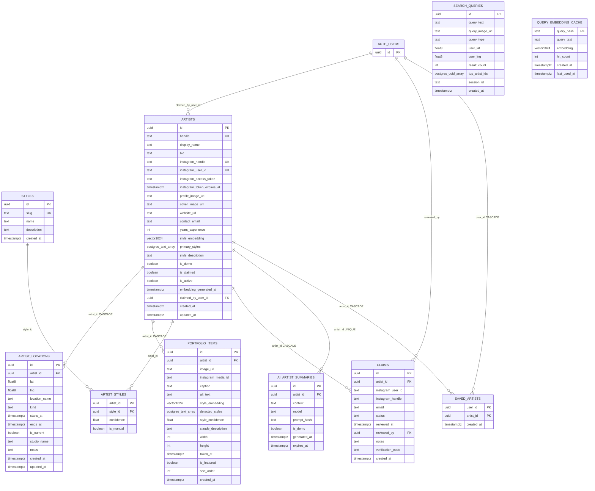

# InkSpot database schema diagram

Derived from [`supabase/migrations/001_initial_schema.sql`](../supabase/migrations/001_initial_schema.sql), [`002_search_function.sql`](../supabase/migrations/002_search_function.sql) (function only), and [`003_claimed_by_user.sql`](../supabase/migrations/003_claimed_by_user.sql).

**PNG / SVG export:** paste the Mermaid block below into [mermaid.live](https://mermaid.live) → **Actions → Export**.

---

## Entity–relationship (full column detail)

Diagram is wide by design; zoom or export to SVG for readability.

**Type notes.** `vector1024` = Postgres **`VECTOR(1024)`** (pgvector extension). **`postgres_text_array`** = **`TEXT[]`**. **`postgres_uuid_array`** = **`UUID[]`**. **`claimed_by_user_id`** on **`artists`** is added in migration 003. **`instagram_user_id`** on **`claims`** is **`TEXT`** in the migration (stores submitting user id — column name retained from earlier flows).

`search_artists(...)` joins `artists` + `artist_locations` inside SQL — see migration 002 — and is not modeled as a table.

---

## Table index

| Table | Purpose |
| --- | --- |
| `auth.users` | Supabase Auth (magic link). |
| `artists` | Profile row + `style_embedding`; `claimed_by_user_id` → auth user (migration 003). |
| `artist_locations` | Nomadic geography (`home_base` / `guest_spot` / `traveling`). |
| `portfolio_items` | Public image URLs + per-item embeddings / styles / `sort_order`. |
| `styles` | Style catalog slug + name (seed rows in 001). |
| `artist_styles` | Artist ↔ style M:N (confidence / manual). |
| `claims` | Onboarding verification (`verification_code` in 003). |
| `saved_artists` | Composite PK `(user_id, artist_id)`. |
| `search_queries` | Search telemetry (no FK to `artists`). |
| `query_embedding_cache` | Text-query embedding cache by `query_hash`. |
| `ai_artist_summaries` | One row per artist (`artist_id` UNIQUE). |
